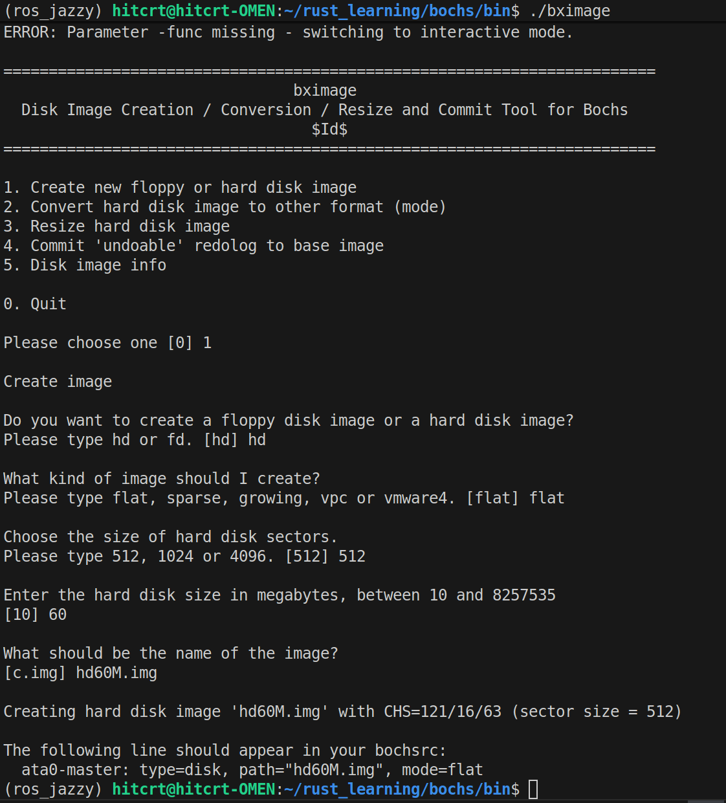

# 🔧Bochs的急流勇进

## 安装

> **bochs源码的链接** [github_bochs](https://github.com/bochs-emu/Bochs)

> **不要使用releases里面的版本他有问题** [issue关于releases的版本](https://github.com/bochs-emu/Bochs/issues/619)

- 在bochs中编译

```bash
./configure --prefix=/home/hitcrt/rust_learning/bochs --enable-debugger --enable-disasm --enable-iodebug --enable-x86-debugger --with-x --with-x11
make
make install 
```

## 之后测试使用
**需要使用bximage创建磁盘,然后使用bochs运行**

### **磁盘创建**
```bash
./bximage
```




- 生成`hd60M.img`就是成功

- `bochsrc.disk`

```markdown
#######################################
#### Configuration file for Bochs  ###
######################################
megs: 32

romimage: file=/home/hitcrt/rust_learning/bochs/share/bochs/BIOS-bochs-latest
vgaromimage: file=/home/hitcrt/rust_learning/bochs/share/bochs/VGABIOS-lgpl-latest

boot: disk
log: bochsout.txt

mouse: enabled=0
keyboard: keymap=/home/hitcrt/rust_learning/bochs/share/bochs/keymaps/x11-pc-us.map

ata0:enabled=1,ioaddr1=0x1f0,ioaddr2=0x3f0,irq=14
ata0-master: type=disk, path="/home/hitcrt/rust_learning/bochs/bin/hd60M.img",mode=flat,cylinders=121,heads=16,spt=63

############### end ###############

```

### **bochs运行**
- 创建`linux000.bxrc`之后
- 使用`./bochs -f linux000.bxrc -dbg_gui`运行,最后的选项 **-dbg_gui** 是加上调试窗口

## **makefile简单介绍**
当然可以～我用一个小例子给你把 Makefile 的基本概念过一遍，适合刚开始上手那种 😊

---

### 1. Make 是干嘛的？

在 Linux / macOS 这类环境里，我们经常用 `make` 来**自动化编译**和执行一些命令。
当你在目录里敲：

```bash
make
```

它会去找当前目录下名字叫 **`Makefile`** 或 `makefile` 的文件，根据里面写的“规则”来决定要执行哪些命令，比如编译 `.c` 生成 `.o`，再链接生成可执行文件。([CSDN][1])

---

### 2. 一条最基本的规则长啥样？

通用格式是：([Massachusetts Institute of Technology][2])

```text
target: prerequisites
[TAB] command
```

* **target（目标）**：要生成的文件，比如 `main.o`、`app`，也可以是一个“伪目标”，比如 `clean`。
* **prerequisites（依赖）**：生成这个目标之前必须已经存在或更新好的文件。
* **command（命令）**：真的在 shell 里执行的那行命令（前面必须是一个 TAB，而不是空格）。

例子：

```makefile
app: main.o util.o
	gcc main.o util.o -o app

main.o: main.c
	gcc -c main.c

util.o: util.c
	gcc -c util.c
```

执行 `make` 或 `make app` 时，它会：

1. 发现目标 `app` 依赖 `main.o`、`util.o`
2. 如果 `.o` 不存在或比 `.c` 旧，就先执行下面两个规则去编译
3. 最后再链接生成 `app`

Make 会用**文件时间戳**判断“要不要重新编译”，所以只有改动过的文件才会触发重编译。([CSDN][3])

---

### 3. 默认目标 & 多个目标

* **默认目标**：Makefile 里**第一条规则的目标**，就是你直接敲 `make` 时要构建的目标，一般起名 `all`：([Massachusetts Institute of Technology][2])

```makefile
all: app
```

* 多个目标也行，比如：

```makefile
all: app test
```

---

### 4. 变量（相当于简单的宏）

Makefile 里的变量就像 shell 里的变量，用来少写重复东西：([CSDN][1])

```makefile
CC = gcc
CFLAGS = -Wall -g

app: main.o util.o
	$(CC) $(CFLAGS) main.o util.o -o app
```

常见写法：

* `NAME = value` 定义
* 用 `$(NAME)` 引用

---

### 5. 自动变量（写规则更省事）

在命令里可以用一些“自动变量”：([CSDN][3])

* `$@`：当前规则的目标名
* `$<`：第一个依赖
* `$^`：所有依赖

例如编译 `.c` → `.o`：

```makefile
%.o: %.c
	$(CC) $(CFLAGS) -c $< -o $@
```

这就是一条**模式规则**（pattern rule），`%` 代表通配符，可以自动匹配 `main.c -> main.o`、`util.c -> util.o` 等。([廖雪峰的官方网站][4])

---

### 6. 伪目标 `.PHONY`（非常常用！）

像 `clean` 这种目标只是执行一段命令，并不生成同名文件，所以通常写成“伪目标”：([GNU][5])

```makefile
.PHONY: clean

clean:
	rm -f *.o app
```

为什么要 `.PHONY`？

1. 防止当前目录里真的有个叫 `clean` 的文件，导致 `make clean` 认为“已经是最新的”而不执行。
2. 被标记为 `.PHONY` 的目标，总是会执行对应命令，且略过隐式规则搜索，性能更好。([GNU][5])

---

### 7. 一个完整、简洁的示例

放在同一目录：`main.c`、`util.c`、`Makefile`：

```makefile
CC = gcc
CFLAGS = -Wall -g

.PHONY: all clean

all: app

app: main.o util.o
	$(CC) $(CFLAGS) $^ -o $@

%.o: %.c
	$(CC) $(CFLAGS) -c $< -o $@

clean:
	rm -f *.o app
```

使用方式：

```bash
make        # 编译生成 app
make clean  # 清理
```


[1]: https://blog.csdn.net/tekin_cn/article/details/144305864?utm_source=chatgpt.com "Makefile 基础语法，默认目标设置，伪目标.PHONY的作用和 ..."
[2]: https://web.mit.edu/gnu/doc/html/make_4.html?utm_source=chatgpt.com "GNU Make - Writing Rules"
[3]: https://blog.csdn.net/weixin_43145989/article/details/144215705?utm_source=chatgpt.com "Makefile 中的规则如何执行？_makefile里有多个target,怎么 ..."
[4]: https://liaoxuefeng.com/books/makefile/pattern-rules/?utm_source=chatgpt.com "使用模式规则 - Makefile教程 - 廖雪峰的官方网站"
[5]: https://www.gnu.org/software/make/manual/html_node/Phony-Targets.html?utm_source=chatgpt.com "Phony Targets (GNU make)"
