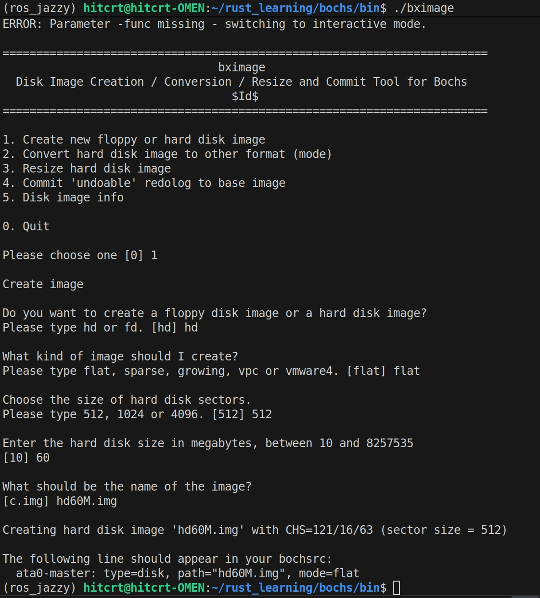
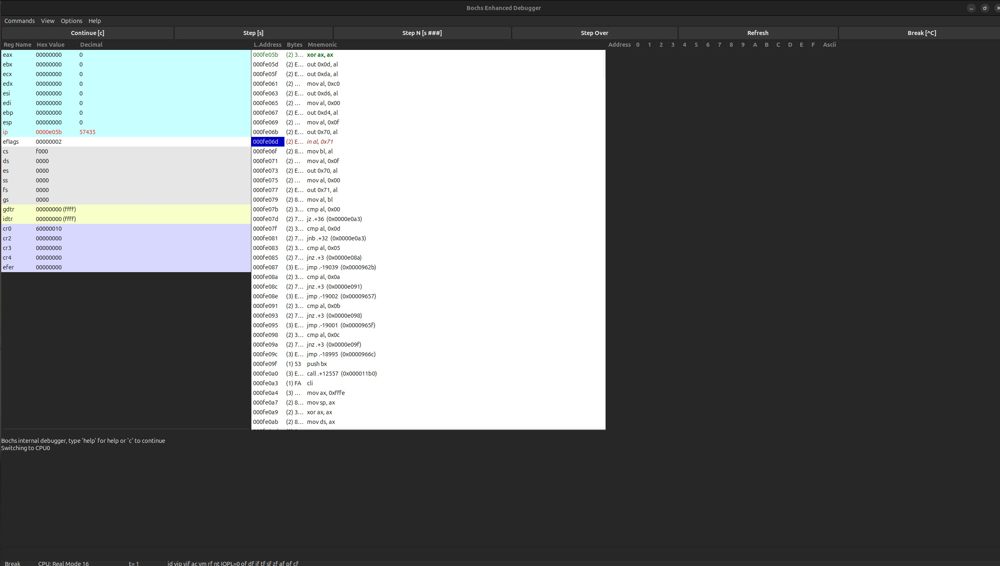

# 🔧Bochs的急流勇进

## 安装

> **bochs源码的链接** [github_bochs](https://github.com/bochs-emu/Bochs)

> **不要使用releases里面的版本他有问题** [issue关于releases的版本](https://github.com/bochs-emu/Bochs/issues/619)

- 在bochs中编译

```bash
./configure --prefix=/home/hitcrt/rust_learning/bochs --enable-debugger --enable-disasm --enable-iodebug --enable-x86-debugger --with-x --with-x11
make
make install 
```

## 之后测试使用
**需要使用bximage创建磁盘,然后使用bochs运行**

### **磁盘创建**
```bash
./bximage
```




- 生成`hd60M.img`就是成功

- `bochsrc.disk`

```markdown
#######################################
#### Configuration file for Bochs  ###
######################################
megs: 32

romimage: file=/home/hitcrt/rust_learning/bochs/share/bochs/BIOS-bochs-latest
vgaromimage: file=/home/hitcrt/rust_learning/bochs/share/bochs/VGABIOS-lgpl-latest

boot: disk
log: bochsout.txt

mouse: enabled=0
keyboard: keymap=/home/hitcrt/rust_learning/bochs/share/bochs/keymaps/x11-pc-us.map

ata0:enabled=1,ioaddr1=0x1f0,ioaddr2=0x3f0,irq=14
ata0-master: type=disk, path="/home/hitcrt/rust_learning/bochs/bin/hd60M.img",mode=flat,cylinders=121,heads=16,spt=63

############### end ###############

```

### **bochs运行**
- 创建`linux000.bxrc`之后
- 使用`./bochs -f linux000.bxrc -dbg_gui`运行,最后的选项 **-dbg_gui** 是加上调试窗口


## 调试窗口使用
- 使用如下指令运行调试模式
```bash
hitcrt@hitcrt-OMEN:~/rust_learning/bochs/bin$ ./bochs -f linux000.bxrc -dbg_gui
```

> 左上角command放断点,然后相应代码段会**变红**,当前执行的代码段是**绿色**的

- view的`**current MemDump**`可以看内存,使用view最上面两个可以输入地址