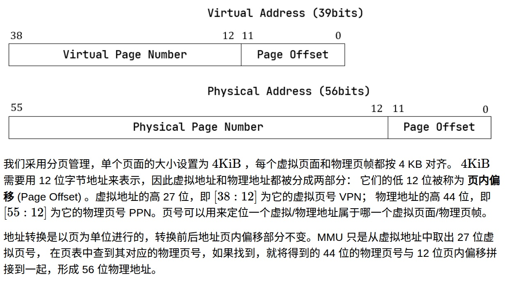
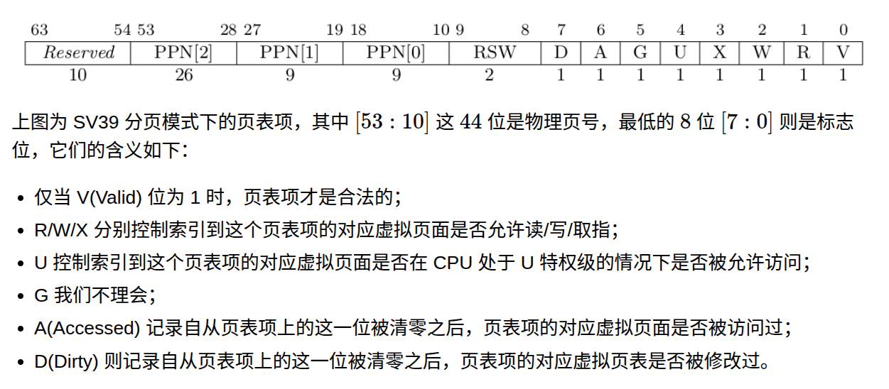

# 💾r-core实验4虚拟内存空间

```{important}
写在前面:虚拟内存需要解决的问题:
1. 应用程序比内存大怎么办?
2. 好多应用程序都用物理地址,那么谁来管理?写错了怎么办?能不能每个程序都有一个独立的地址空间?

**分页的虚拟内存能解决这些问题**

- 页表是一个数组(准确来说是一个树的结构),每个应用都有一个
```

- 页表
```rust
pub struct PageTable {
    root_ppn: PhysPageNum,
    frames: Vec<FrameTracker>,
}
```

## 1关于虚拟地址的简单介绍

```{note}
**RV64 架构中虚拟地址为何只有 39 位？**

虚拟地址长度确实应该和位宽一致为 64 位，但是在启用 SV39 分页模式下，只有低 39 位是真正有意义的。
SV39 分页模式规定 64 位虚拟地址的 $`[63:39]`$ 这 25 位必须和第 38 位相同，否则 MMU 会直接认定它是一个
不合法的虚拟地址。。

也就是说，所有 $2^{64}$ 个虚拟地址中，只有最低的 $256\text{GiB}$ （当第 38 位为 0 时）
以及最高的 $256\text{GiB}$ （当第 38 位为 1 时）是可能通过 MMU 检查的。
```

- 简单看一下虚拟内存





- 简单总结下,就是我有一个虚拟地址,我有`vpn:27`和`po:12`,
  - 之后查表得到`ppn:44`,但是查表的过程中还会有其他信息
    - 仅当 V(Valid) 位为 1 时，页表项才是合法的；
    - R/W/X 分别控制索引到这个页表项的对应虚拟页面是否允许读/写/取指；
    - U 控制索引到这个页表项的对应虚拟页面是否在 CPU 处于 U 特权级的情况下是否被允许访问；
    - G 我们不理会；
    - A(Accessed) 记录自从页表项上的这一位被清零之后，页表项的对应虚拟页面是否被访问过；
    - D(Dirty) 则记录自从页表项上的这一位被清零之后，页表项的对应虚拟页表是否被修改过。

## 2操作系统在虚拟内存体系中需要做什么?

```{tip}
虚拟内存机制大约是这样:
一个执行触发需要操作虚拟地址`addr`,那么cpu就会把这个地址给到`mmu`,
`mmu`会查TLB,未命中的话就查多级页表,读出PPN和权限位
- 没有异常:组成PA访问内存
- 异常(例如缺页或者页表项无效):触发trap
```
**那么操作系统要干啥?**
- 主要就是维护这个页表,比如
  - 1. 哪个虚拟地址段映射到哪个物理页帧?
  - 2.  


## 3本章节的rust代码简单介绍

### 对于物理页的管理
- 所有的物理页最终都是由全局变量`FRAME_ALLOCATOR`管理,都是经过下面的两耳光方法

```rust
pub struct StackFrameAllocator {
    current: usize,  //空闲内存的起始物理页号
    end: usize,      //空闲内存的结束物理页号
    recycled: Vec<usize>,
}
impl FrameAllocator for StackFrameAllocator {
    fn alloc(&mut self) -> Option<PhysPageNum> {
        if let Some(ppn) = self.recycled.pop() {
            Some(ppn.into())
        } else {
            if self.current == self.end {
                None
            } else {
                self.current += 1;
                Some((self.current - 1).into())
            }
        }
    }
    fn dealloc(&mut self, ppn: PhysPageNum) {
        let ppn = ppn.0;
        // validity check
        if ppn >= self.current || self.recycled
            .iter()
            .find(|&v| {*v == ppn})
            .is_some() {
            panic!("Frame ppn={:#x} has not been allocated!", ppn);
        }
        // recycle
        self.recycled.push(ppn);
    }
}
```


## 页表的具体实现的剖析

```{note}
**多级页表的访问**


- 1. 首先一个VA一定是划分成为好多VPN 加上一个PO,所以一个应用程序本身需要存储一个物理地址
- 2. 这个物理地址和第一个VPN组合可以拿到一个entry,也是一个物理地址,这个物理地址指向二级页表(也是PageTable这个结构体)的首地址
- 3. 这样迭代得到真实的PPN,所以一个页表只需要存储一个物理地址,一个数组(长度为$2^{len(VPN)}$,里面元素是一个新的页表)

```

```rust
pub struct PageTable {
    root_ppn: PhysPageNum,//一个usize的封装
    frames: Vec<FrameTracker>,
}
pub struct FrameTracker {
    /// physical page number
    pub ppn: PhysPageNum,
}
```

### 页表需要做什么?(实现什么操作)


### elf简单介绍
- 1 解决的问题:
  - 一个程序里有代码、有数据、有常量、有调试信息……怎么统一打包?
  - 链接器要怎么组合不同的代码?
  - 操作系统加载器 怎么把代码加载到内存跑起来?

```text
+---------------------+
| ELF Header          |  文件头，描述整个文件的一些信息
+---------------------+
| Program Header Tbl  |  程序头表：给“加载器”看的段信息（segments）
+---------------------+
|      Segments       |  若干段：代码段、数据段等（给运行时用）
|   (code, data...)   |
+---------------------+
| Section Header Tbl  |  节头表：给“链接器/调试器”看的节（sections）
+---------------------+
```

```{important}
1. **ELF 头（ELF Header）**

   * 标记“我是 ELF”，“我是 32/64 位”，“我是哪个 ISA（riscv）”
   * 记录：

     * `e_entry`：**入口地址**（也就是 `_start` 的虚拟地址）
     * `e_phoff`：program header 表在文件中的偏移
     * `e_shoff`：section header 表在文件中的偏移
     * `e_phnum`：program header 数量
     * `e_shnum`：section header 数量

2. **Program Header Table（程序头表）**

   * 每一项叫一个 **Program Header**（你代码里的 `ph`）
   * 对应一个“**段（Segment）**”，也就是：运行时要放进内存的一块连续区域
   * OS 在加载时，**主要就看这个表**

3. **Section Header Table（节头表）**

   * 每一项对应一个 **节（Section）**，比如 `.text`、`.rodata`、`.data`、`.bss`、`.debug` 等
   * 编译/链接时用得多：链接器根据节来合并、重定位
   * 对于一个简单的 OS 来说：**加载 ELF 时基本可以完全无视这个表**


4. 段（Segment） vs 节（Section）


* **Section（节）**

  * 面向编译器/链接器/调试器
  * 例如：`.text`、`.rodata`、`.data`、`.bss`、`.symtab`、`.strtab`、`.debug_info` 等
  * 链接器：把多个 .o 文件里的 `.text` 合起来，放到最终可执行文件里一个统一的 `.text` 区域。
  - **eg**:
  ```txt
    .section .text.trampoline
    .globl __alltraps
    .globl __restore
    .align 2
  ```

* **Segment（段）**

  * 面向 OS loader
  * 每个段描述：“**把文件中哪一块内容，装载到内存的哪一段虚拟地址，权限是什么**”。

**简单的例子**：

* `.text` / `.rodata` 合在一个 PT_LOAD 段里（只读+可执行）
* `.data` / `.bss` 合在一个 PT_LOAD 段里（可读+可写）
* 调试信息、符号表之类的节不放进任何 PT_LOAD 段，运行时不需要加载。

**本章节加载应用程序ELF的代码里用的是 Program Header（段），而不是 Section Header（节）。**

```

- 对于rust而言一个 `PT_LOAD` 类型的 Program Header 一般包含：

  * `type`：类型，常见的：

    * `PT_LOAD`：要加载到内存的段（你关心的）
    * `PT_PHDR`：自身描述
    * `PT_NOTE`：备注
    * 等等
  * `offset`：**这段内容在 ELF 文件中的偏移**

    * 你这里用 `elf.input[ph.offset() .. ph.offset()+file_size]`
      就是从文件中把这一段内容切出来
  * `vaddr`（`virtual_addr()`）：**这段内容在进程虚拟地址空间中要放的位置**

    * 然后你拿它去做 `start_va`，告诉 OS：“这个 segment 在虚拟地址上从这里开始”
  * `filesz`（`file_size()`）：**在文件中占多少字节**

    * 也就是实际有数据的部分（代码、已初始化的数据）
  * `memsz`（`mem_size()`）：**装载到内存后占多少字节**

    * 可能比 `filesz` 大，因为 `.bss` 等**只在内存中存在、在文件中是省略的要填零的部分**
  * `flags`：

    * R / W / X，这就是你用来构建 `MapPermission` 的依据
  * `align`：对齐要求（通常是页大小，例如 0x1000）


## 疑问汇总

### 1 怎么在分页模式里面没有看到LDT GDT这些结构?是不是被页表直接取代了?

### 2 rust的trait,简单回忆
- 只需要看trait接口就知道这个接口的调用规范(最起码是知道输入输出),
```rust
trait FrameAllocator {
    fn new() -> Self;
    fn alloc(&mut self) -> Option<PhysPageNum>;
    fn dealloc(&mut self, ppn: PhysPageNum);
}

pub struct StackFrameAllocator {
    current: usize,  //空闲内存的起始物理页号
    end: usize,      //空闲内存的结束物理页号
    recycled: Vec<usize>,
}

impl FrameAllocator for StackFrameAllocator {
    fn new() -> Self {
        Self {
            current: 0,
            end: 0,
            recycled: Vec::new(),
        }
    }
}
//使用的时候直接   FRAME_ALLOCATOR.exclusive_access().alloc()

```

- 不定义traits也是可以的,直接impl

```rust
pub struct VirtAddr(pub usize);
impl VirtAddr {
    /// Get the (floor) virtual page number
    pub fn floor(&self) -> VirtPageNum {
        VirtPageNum(self.0 / PAGE_SIZE)//可以把他写成带余除法理解
    }
    //我是省略号
}

```

### 3我们的操作系统是怎么设置每个程序的trap的?

> 在初始化的时候设置虚拟地址最高位为trap函数

- 先看初始化的时候的代码

### 4 几个权限R W X
> R是read W是write x是excute

### 5 为什么trap的时候执行是连续的?地址空间切换了pc为什么不用改?

- trap被设计成在内核地址空间和用户地址空间都是最高地址
