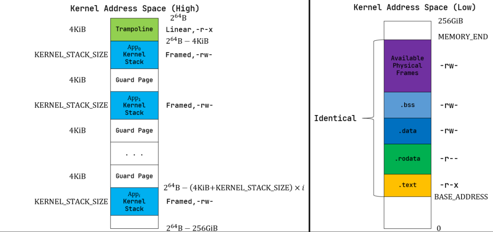

# 💾r-core实验5进程管理

```{note}
这次开始就是看代码,不懂再看文档,看代码的顺序是按照文档来的
```


## 老伙计脱胎换骨了

- 新的执行是`Processor`,老的`task manager`现在维护的是队列

```rust
pub struct Processor {
    ///The task currently executing on the current processor
    current: Option<Arc<TaskControlBlock>>,

    ///The basic control flow of each core, helping to select and switch process
    idle_task_cx: TaskContext,//切换应用使用的
}
pub struct TaskManager {
    ready_queue: VecDeque<Arc<TaskControlBlock>>,
}
```
- processor 本质是当前在执行的应用,是一个cpu!,那么多核cpu是不是就是多个processor

## 操作系统的整个流程

```{note}

这个板块是按照我们的操作系统的初始化流程介绍所有的板块
- `exclusive_access`是确保这个对象只是被一个进程引用,不然会直接报错!是rust的好东西
- `lazy_static!`是对象在第一次被引用的时候初始化,有利于优化?也许吧

```
### HEAP_ALLOCATOR

> 本质是一个元组结构体,是对一个锁的结构的包装

```rust
static HEAP_ALLOCATOR: LockedHeap = LockedHeap::empty();
pub struct LockedHeap(Mutex<Heap>);

```

### FRAME_ALLOCATOR

>本质包括当前最小的,最大的,还有已经回收过的页面

```rust
pub struct StackFrameAllocator {
    current: usize,
    end: usize,
    recycled: Vec<usize>,
}
```

```{important}
运行足够长的时间之后这个会退化成一个大数组,里面的元素是所有的物理页号
```

### KERNEL_SPACE
> 本质上是一个memoryset,是内核的地址空间,和上一章的布局相同

```rust
pub struct MemorySet {
    page_table: PageTable,
    areas: Vec<MapArea>,//对应各个程序段
}
```

- 注意每个应用的内核栈是有变化的,这次每个应用的内核栈不是固定的了,他有自己的分配器(至于为什么不直接使用pid作为索引,他会共用栈)

- 内核的页表是直接映射的,也就是和不开启虚拟内存的区别只是多一个访问mmu,这样做也是因为内核地址空间的布局可以是固定的,不像应用程序
- 内核的页表会对所有的物理页面进行映射,具体利用率的分析可以看上一章节
- 当调用`activate`方法的时候他就会启用虚拟内存

### INITPROC
> 这个是第一个进程,是对于`TaskControlBlock`的封装,从这也能看出对于一个进程内核需要维护什么

```rust
pub struct TaskControlBlock {//本质是一个链表,但是这个结构体也包含了一个进程的所有信息
    // Immutable
    /// Process identifier
    pub pid: PidHandle,

    /// Kernel stack corresponding to PID
    pub kernel_stack: KernelStack,

    /// Mutable
    inner: UPSafeCell<TaskControlBlockInner>,
}

pub struct TaskControlBlockInner {
    /// The physical page number of the frame where the trap context is placed
    pub trap_cx_ppn: PhysPageNum,

    /// Application data can only appear in areas
    /// where the application address space is lower than base_size
    pub base_size: usize,

    /// Save task context
    pub task_cx: TaskContext,

    /// Maintain the execution status of the current process
    pub task_status: TaskStatus,

    /// Application address space
    pub memory_set: MemorySet,

    /// Parent process of the current process.
    /// Weak will not affect the reference count of the parent
    pub parent: Option<Weak<TaskControlBlock>>,

    /// A vector containing TCBs of all child processes of the current process
    pub children: Vec<Arc<TaskControlBlock>>,

    /// It is set when active exit or execution error occurs
    pub exit_code: i32,

    /// Heap bottom
    pub heap_bottom: usize,

    /// Program break
    pub program_brk: usize,
}
```

**下面介绍他的初始化流程**


- 1. 先在内核的数据段里面读取应用的elf,并转化成为(内存段,栈地址,应用的入口地址),如上图所示

- 2. 给这个进程分配一个`pid`,底层是一个`usize`数
    - 这个地方引用了`PID_ALLOCATOR`的底层是`RecycleAllocator`,他类似`FRAME_ALLOCATOR`,是锁定pid的,回收资源放在数据里面
- 3. 分配内核栈`KernelStack`,底层是一个`usize`指针
    - 这个地方引用了`KSTACK_ALLOCATOR`,底层也是`RecycleAllocator`,因为每个应用程序的内核栈也需要`id`,所以直接复用之前的`pid`锁定工具了
    - 这个内核栈最终会向着内核的代码段插入一段
- 4. 接下来是构造这个进程的inner部分,介绍以下需要什么,通过场景分类
    - 应用状态(`task_status`):一个应用有四个(未初始化,准备运行,正在运行,运行结束),我们内核似乎不会有没有初始化的程序
    - trap的上下文
        ```rust
        pub struct TrapContext {
            /// General-Purpose Register x0-31
            pub x: [usize; 32],//所有寄存器
            /// Supervisor Status Register
            pub sstatus: Sstatus,
            /// Supervisor Exception Program Counter
            pub sepc: usize,
            /// Token of kernel address space
            pub kernel_satp: usize,//内核的页表
            /// Kernel stack pointer of the current application
            pub kernel_sp: usize,//刚刚构造的只属于这个进程的内核栈
            /// Virtual address of trap handler entry point in kernel
            pub trap_handler: usize,
        }
        ```
      - 说明一个应用可能会被打断(进入trap),
- 5. 调用`TASK_MANAGER`的add方法 把第一个进程添加到他的队列里面
- 

### PROCESSOR
> 标记当前cpu在运行的程序的信息,还有trap的上下文(不知道这个上下文是怎么用的)

```rust
pub struct Processor {
    ///The task currently executing on the current processor
    current: Option<Arc<TaskControlBlock>>,//标记当前cpu在运行的程序的信息

    ///The basic control flow of each core, helping to select and switch process
    idle_task_cx: TaskContext,//这个是内核的上下文,分析`__switch`函数可以知道
}

```

- 1. 标记之前的`INITPROC`的进程状态为`Running`
- 2. 根据之前保存的`TaskContext`执行__switch,`TaskContext`是一个很简短的东西
```text
__switch:
    # __switch(
    #     current_task_cx_ptr: *mut TaskContext,
    #     next_task_cx_ptr: *const TaskContext
    # )
    # save kernel stack of current task
    sd sp, 8(a0)
    # save ra & s0~s11 of current execution
    sd ra, 0(a0)
    .set n, 0
    .rept 12
        SAVE_SN %n
        .set n, n + 1
    .endr
    # restore ra & s0~s11 of next execution
    ld ra, 0(a1)
    .set n, 0
    .rept 12
        LOAD_SN %n
        .set n, n + 1
    .endr
    # restore kernel stack of next task
    ld sp, 8(a1)
    ret

```
- 当刚刚从内核态执行第一个进程的时候,是把内核的栈指针和寄存器保存在`Processor`的`idle_task_cx`里面的
- 这个函数设置`ld ra, 0(a1)`的时候修改了返回地址,所以ret的时候会直接去执行第一个进程
- 他是跳转到了`__restore`函数,注意参数是由`__switch`给的
    ```text
    __restore:
        # a0: *TrapContext in user space(Constant); a1: user space token
        # switch to user space
        csrw satp, a1 #开启用户页表
        sfence.vma   #刷新TLB
        csrw sscratch, a0 #下次trap使用这个寄存器,等下在TODO上面梦幻联动
        mv sp, a0       #把trap context当作栈
        # now sp points to TrapContext in user space, start restoring based on it
        # restore sstatus/sepc
        ld t0, 32*8(sp)  
        ld t1, 33*8(sp)
        csrw sstatus, t0  #恢复用户态
        csrw sepc, t1     #恢复pc
        # restore general purpose registers except x0/sp/tp
        ld x1, 1*8(sp)
        ld x3, 3*8(sp)
        .set n, 5
        .rept 27
            LOAD_GP %n
            .set n, n+1
        .endr
        # back to user stack
        ld sp, 2*8(sp)
        sret
    ``` 
    - 这个函数的只要功能是恢复用户寄存器,使用`csrw`

```{note}
到现在为止是开始跑了, 现在的调度算法很简单,就是每个程序都执行相同的时间(由时钟trap控制),
到时间了去`ready_queue`里面找下一个`ready`的,所以

```
### 

### TODO是所有的进程都有自己的heap吗？

## 看系统调用

### 1. sysfork


## 疑问汇总

### 1. Processor里面保存的上下文是谁的上下文? 

### 2. `RecycleAllocator`和`FRAME_ALLOCATOR`都是把回收的资源放在一个数组里面,不会有资源浪费吗?
- 离散的数据存储,只能说是必要开支了

### 3. 为什么一个应用要有`TaskContext`和对应的内核栈?不能把`TaskContext`里面的数据全部放到内核栈里面吗?

- cpu是没有内核态的概念的,他只是知道取指执行,那么如果在内核态我们不给sp寄存器赋值,可能某些指令不能执行
  - 也就是说内核栈是一定要的
- risc-v不像x86,他需要我手动保存任务的寄存器等信息
  - `x86`的cpu会自动构建`tss`,也就是自动把需要保存的东西按照`TR`的地址压入内存,不够自由
  - `risc-v`类似x86保存tss的行为发生在`__alltraps`函数的入口,
    - 用户态的`stvec`是在`trap_return`的时候写入的,我们的操作系统目前默认不会有内核态进入trap
      - 具体来说就是从`__switch`结束的返回地址开始


### 3. `TaskContext`和`TrapContext`的区别是什么?

- `TrapContext`的构造位于创建进程的时候,他保存:
    ```rust
    pub struct TrapContext {
        /// General-Purpose Register x0-31
        pub x: [usize; 32],//32个寄存器,其实x0和x4是不保存的,但是为了对齐,还是开了32个
        /// Supervisor Status Register
        pub sstatus: Sstatus,//标记内核态还是用户态的寄存器
        /// Supervisor Exception Program Counter
        pub sepc: usize,//就是pc
        /// Token of kernel address space
        pub kernel_satp: usize,//内核的页表
        /// Kernel stack pointer of the current application
        pub kernel_sp: usize,//应用的内核栈
        /// Virtual address of trap handler entry point in kernel
        pub trap_handler: usize,//trap执行的函数
    }
    ```

- `TaskContext`的构造位于初始化进程的时候
    ```rust
        /// Create a new task context with a trap return addr and a kernel stack pointer
    pub struct TaskContext {
        /// Ret position after task switching
        ra: usize,
        /// Stack pointer
        sp: usize,
        /// s0-11 register, callee saved
        s: [usize; 12],
    }
    pub fn goto_trap_return(kstack_ptr: usize) -> Self {
        Self {
            ra: trap_return as usize,
            sp: kstack_ptr,
            s: [0; 12],
        }
    }
    ```

- 什么时候使用`TaskContext`?
  - 情景1,初始化`INITPROC`之后第一次任务切换,`let next_task_cx_ptr = &task_inner.task_cx as *const TaskContext;`
    - 目的是跳转到`trap_return`,开始使用`TrapContext`进行恢复现场的操作

- 什么时候使用`TrapContext`?
  - 情景1,在`trap_return`函数中,用于恢复寄存器,具体恢复方式是拿到`TrapContext`还有`user_satp(这个进程的页表)`
    - 说明:`TrapContext`是放在虚拟地址的倒数第二个页面的,所以只要有页表就可以找到他
    - 之后传入`__restore`,观察这个函数可以知道,其实是把`TrapContext`当作栈使用!!因为他把sp赋值为这个了
    - TrapContext是放在物理地址的最高页面的,他和栈不一定相邻,之后恢复用户栈是使用`ld sp, 2*8(sp)`

- 应用主动sys_call的时候,怎么利用上面的两个结构体?
  - 也就是说应用进入trap了,那么要看`stvec`寄存器里面是什么,他是由`trap_return`函数在`set_user_trap_entry`设置
  - 从`set_user_trap_entry`函数可以知道是向着`stvec`写了虚拟内存最高位的地址,那也就是`map_trampoline()`函数设置的`strampoline()`
  - 这个是链接器做的事情,他把`.text.trampoline`函数放到这个地方了对应的就是`__alltraps`函数
  - 也就是保存寄存器现场,除了`x4`都保存了(由于x0是0常量所以也没有保存)

### 4. 内核的那么多结构体是放哪里的?
- 内核就是一个大应用程序,肯定有自己的data段啊


### 5. 应用程序的trap流程

- 先读取stvec中的地址,跳转到那个地方(就是`__alltraps`)保存通用寄存器,然后切换到内核态之后就进入`trap_handler`
- 关于其中的参数调用`risc-v`的约定是系统调用号是`a7(x17)`,参数放在`a0–a5(x10–x15)`，返回值放回 a0(x10)
    - 这个和四件套的关系,参数调用是我们保存在通用寄存器里面的,其他是硬件做的
    - 其实去看`trap_handler`就发现了参数是从`TrapContext`里面拿出来的

### 6. 调用`exec`执行新的应用程序的时候,老的fork出来的应用程序的地址空间要怎么办?
- 可以看到在exec函数中,使用elf数据加载完毕新的程序之后,只是做了一个赋值
```rust
let (memory_set, user_sp, entry_point) = MemorySet::from_elf(elf_data);
let mut inner = self.inner_exclusive_access();
inner.memory_set = memory_set;
```
- 这个会触发rust的所有权机制,然后drop掉老的

### 7. 系统调用里面把指针传来传去的,为什么rust的安全检查没有拦截我?
- 我们都是使用的`*mut TimeVal`而不是`&mut TimeVal`,引用的生命周期是很麻烦的

### 8. 时钟给的时间是什么?

- 本质上是一个寄存器64位数的,除以1e6表示秒,取余1e6表示微秒

### 8. 用户传递给内核一个虚拟地址,但是如果这个虚拟地址上存储的东西跨页了,对于内核来说他是不连续的,那要怎么办?

- 使用一个数组进行分割,如果遇到跨页,就给数组开一个新的段

```rust
pub fn translated_byte_buffer(token: usize, ptr: *const u8, len: usize) -> Vec<&'static mut [u8]> {
    let page_table = PageTable::from_token(token);
    let mut start = ptr as usize;
    let end = start + len;
    let mut v = Vec::new();
    while start < end {
        let start_va = VirtAddr::from(start);
        let mut vpn = start_va.floor();
        let ppn = page_table.translate(vpn).unwrap().ppn();
        vpn.step();
        let mut end_va: VirtAddr = vpn.into();
        end_va = end_va.min(VirtAddr::from(end));
        if end_va.page_offset() == 0 {//选到了
            v.push(&mut ppn.get_bytes_array()[start_va.page_offset()..]);
        } else {
            v.push(&mut ppn.get_bytes_array()[start_va.page_offset()..end_va.page_offset()]);
        }
        start = end_va.into();
    }
    v
}

```

- 返回的v里面是分段的连续地址(逻辑上连续)


### 9. 之前的插入检查函数的问题(没插入却说我插入了)

- 其实是忘记检查pte的合法性了
```rust
while vpn < end_vpn.0 {//页表中有了,那么就需要返回错误
    let mapped = inner
        .memory_set
        .translate(VirtPageNum(vpn))
        .map(|pte| pte.is_valid())//添加一个闭包,检查pte是不是合理的
        .unwrap_or(false);
    if mapped {
        println!("[kernel] pid:{} has the vpn:{}",current_task().unwrap().pid.0,vpn);
        return -1;
    }
    //         if inner
    //     .memory_set
    //     .translate(VirtPageNum(vpn))
    //     .is_some()
    // {
    vpn += 1;
}
```
- 之前怀疑的是在插入的时候插入多了
```rust
inner.memory_set.insert_framed_area(VirtAddr::from(start), VirtAddr::from(end), perm);
```
- 使用println大法发现其实不是的,比如要start:65536 end:65537 他只是会插入65536而已