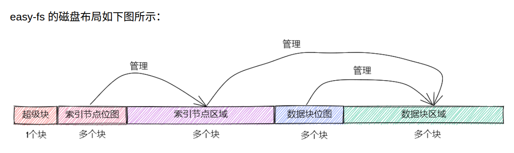

# 💾r-core实验6文件系统

## 操作系统的几个层次的说明


### 1. 块设备接口层
**就是和磁盘驱动通信的部分**
```rust
// easy-fs/src/block_dev.rs
pub trait BlockDevice : Send + Sync + Any {
    fn read_block(&self, block_id: usize, buf: &mut [u8]);//给磁盘号就能读一块
    fn write_block(&self, block_id: usize, buf: &[u8]);//给磁盘号就能写一块
}
```
- 他是把磁盘抽象成和内存一样的好几块了
  - 这个是文件系统做的,和操作系统没有关系,也就是所谓的`ext4`,

### 2. 块缓存层
> 存在的目的是为了加速IO操作

- 块缓存
```rust
// easy-fs/src/lib.rs

pub const BLOCK_SZ: usize = 512;

// easy-fs/src/block_cache.rs

pub struct BlockCache {
    cache: [u8; BLOCK_SZ],//初始化一个长度为512,元素是u8(正好一个字节)的数组,完全符合我们对一个块内存的定义
    //说明这个chache是开在内核堆空间的
    block_id: usize,//由于可能是任意一块,所以需要记录块编号,这里可以认为这个等价于磁盘上面的一块
    block_device: Arc<dyn BlockDevice>,//块属于哪个磁盘(磁盘可能有多个,比如一个电脑有两个m.2插槽)
    modified: bool,//脏位,快速判断写回是否需要修改,如果false他被写回的时候直接drop就好了
}// easy-fs/src/block_cache.rs

impl BlockCache {
    fn addr_of_offset(&self, offset: usize) -> usize {
        &self.cache[offset] as *const _ as usize
    }

    pub fn get_ref<T>(&self, offset: usize) -> &T where T: Sized {
        let type_size = core::mem::size_of::<T>();
        assert!(offset + type_size <= BLOCK_SZ);
        let addr = self.addr_of_offset(offset);
        unsafe { &*(addr as *const T) }
    }

    pub fn get_mut<T>(&mut self, offset: usize) -> &mut T where T: Sized {
        let type_size = core::mem::size_of::<T>();
        assert!(offset + type_size <= BLOCK_SZ);
        self.modified = true;
        let addr = self.addr_of_offset(offset);
        unsafe { &mut *(addr as *mut T) }
    }
}

```
- 这里复习以下rust的生命周期机制:
```rust
let a = cache.get_ref::<f32>(1);
let b = cache.get_ref::<f32>(5); // 这是允许的（都是共享引用）
//但是如果
let a = cache.get_ref::<f32>(1);
let m = cache.get_mut::<f32>(5); // ❌ 不行：已有共享借用时不能再独占借用
//这里的生命周期还需要保证a活得肯定要比cache短,因为这个地方不发生复制,是共享同一个内存进行引用的
```

- 这个数据结构是遵循`RAII`思想的,他的drop也就是判断是否写回的函数
```rust
// easy-fs/src/block_cache.rs

impl BlockCache {
    pub fn sync(&mut self) {
        if self.modified {
            self.modified = false;
            self.block_device.write_block(self.block_id, &self.cache);
        }
    }
}

impl Drop for BlockCache {
    fn drop(&mut self) {
        self.sync()
    }
}
```


## 从操作系统的角度简单理解数据块



- 下面是上图中的文件系统对应具体结构体
```rust
pub struct EasyFileSystem {
    pub block_device: Arc<dyn BlockDevice>,
    pub inode_bitmap: Bitmap,
    pub data_bitmap: Bitmap,
    inode_area_start_block: u32,
    data_area_start_block: u32,
}
```


```{note}
磁盘使用块的形式存储数据,我们需要把磁盘抽象成为一个提供32位索引号就能对`512B`的数据进行操作的东西

- 第一个块是超级块,把他理解成为类似windows的磁盘标识就好
- 第二个块是索引节点
```


### easy-fs 超级块

```rust
// easy-fs/src/layout.rs

#[repr(C)]
pub struct SuperBlock {
    magic: u32,//校验使用的
    pub total_blocks: u32,//总磁盘块数,操作系统读这个就知道后面有多少块
    pub inode_bitmap_blocks: u32,
    pub inode_area_blocks: u32,
    pub data_bitmap_blocks: u32,
    pub data_area_blocks: u32,
}
```

- 索引节点`inode`:
  - 是存储文件信息的数据结构,不直接存储数据,方便扫描等操作
- 数据块:
  - 实际的数据

### 文件索引`inode`


```rust
const INODE_DIRECT_COUNT: usize = 28;
pub struct DiskInode {//一共4+4*28+4+4
    pub size: u32,
    pub direct: [u32; INODE_DIRECT_COUNT],
    pub indirect1: u32,
    pub indirect2: u32,
    type_: DiskInodeType,//这个是4字节的??
}

#[derive(PartialEq)]
pub enum DiskInodeType {
    File,
    Directory,
}
```


## 数据结构的说明

### TaskControlBlockInner进化了
```rust
pub struct TaskControlBlockInner {
    pub trap_cx_ppn: PhysPageNum,
    pub base_size: usize,
    pub task_cx: TaskContext,
    pub task_status: TaskStatus,
    pub memory_set: MemorySet,
    pub parent: Option<Weak<TaskControlBlock>>,
    pub children: Vec<Arc<TaskControlBlock>>,
    pub exit_code: i32,
    pub fd_table: Vec<Option<Arc<dyn File + Send + Sync>>>,
}
```
- 发现其实只是多了一个fd_table,但是这个非常关键,因为同一个文件会被好多进程共享

```{note}
rust中的多态:类似cpp中的templete,是一个未知的数据类型,但是我们知道他一定有哪些方法
- 这里`dyn File + Send + Sync>`就是一个多态,他表示任何拥有`File`,`Send`,`Sync`方法的数据类型
```

```{note}
常见的文件描述符,就是我们的操作系统最开始的时候为初始进程初始化的那些
fd_table: vec![
    // 0 -> stdin 标准输入
    Some(Arc::new(Stdin)),
    // 1 -> stdout 标准输出
    Some(Arc::new(Stdout)),
    // 2 -> stderr 标准异常
    Some(Arc::new(Stdout)),
],
```

- 这里的File是操作系统中的文件
```rust
pub trait File: Send + Sync {
    /// the file readable?
    fn readable(&self) -> bool;
    /// the file writable?
    fn writable(&self) -> bool;
    /// read from the file to buf, return the number of bytes read
    fn read(&self, buf: UserBuffer) -> usize;
    /// write to the file from buf, return the number of bytes written
    fn write(&self, buf: UserBuffer) -> usize;
}
pub struct UserBuffer {
    /// A list of buffers,就是好多字节数据
    pub buffers: Vec<&'static mut [u8]>,
}
```


### BLOCK_DEVICE
> 可以理解为就是磁盘,提供磁盘第几块还有一个内存段,就可以进行读写操作,具体的实现是qemu模拟器的虚拟磁盘提供的驱动,我们不看

```rust
pub trait BlockDevice: Send + Sync + Any {//仅仅是一个trait,代表下面的BLOCK_DEVICE是一个实现了这两个接口的数据类型
    ///Read data form block to buffer
    fn read_block(&self, block_id: usize, buf: &mut [u8]);
    ///Write data from buffer to block
    fn write_block(&self, block_id: usize, buf: &[u8]);
}

type BlockDeviceImpl = virtio_blk::VirtIOBlock;
lazy_static! {
    /// The global block device driver instance: BLOCK_DEVICE with BlockDevice trait
    pub static ref BLOCK_DEVICE: Arc<dyn BlockDevice> = Arc::new(BlockDeviceImpl::new());
}

```

```{note}
这里我们的BLOCK_DEVICE是对`virtio_blk::VirtIOBlock`的一个封装,他是一个虚拟的磁盘应用,
- **这里还要注意BLOCK_DEVICE是一个ARC对象,而且他支持多进程访问,就是(可以被不同进程同时引用,可以被移动到多个线程)**
- 具体的实现是在`os/src/drivers/block/virtio_blk.rs`中,简单实现了这个trait
```

### ROOT_INODE

> 根目录的inode,下面具体介绍

- Inode的数据结构
```rust
pub struct Inode {
    block_id: usize,//位于磁盘的哪个block
    block_offset: usize,//位于磁盘的block的哪个offset
    fs: Arc<Mutex<EasyFileSystem>>,//对于文件系统的抽象(真实的虚拟设备+抽象的几个结构超级块啥的)
    block_device: Arc<dyn BlockDevice>,//这里又放了一个,目前意义不明
}
```

- 关于`EasyFileSystem`的简单介绍
  - open就是从超级块里面还原出四件套

```rust
pub struct EasyFileSystem {
    ///Real device
    pub block_device: Arc<dyn BlockDevice>,
    ///Inode bitmap
    pub inode_bitmap: Bitmap,//是把一个整数映射到一个bool变量的数据结构
    //用于实现分配inode,inode是文件的元数据,他记录文件的权限啥的TODO暂未考证
    ///Data bitmap
    pub data_bitmap: Bitmap,//记录每个data块是否被使用
    inode_area_start_block: u32,
    data_area_start_block: u32,
}
pub fn open(block_device: Arc<dyn BlockDevice>) -> Arc<Mutex<Self>> {
    // read SuperBlock
    get_block_cache(0, Arc::clone(&block_device))
        .lock()
        .read(0, |super_block: &SuperBlock| {
            assert!(super_block.is_valid(), "Error loading EFS!");
            let inode_total_blocks =
                super_block.inode_bitmap_blocks + super_block.inode_area_blocks;
            let efs = Self {
                block_device,
                inode_bitmap: Bitmap::new(1, super_block.inode_bitmap_blocks as usize),
                data_bitmap: Bitmap::new(
                    (1 + inode_total_blocks) as usize,
                    super_block.data_bitmap_blocks as usize,
                ),
                inode_area_start_block: 1 + super_block.inode_bitmap_blocks,
                data_area_start_block: 1 + inode_total_blocks + super_block.data_bitmap_blocks,
            };
            Arc::new(Mutex::new(efs))
        })
}
```

- 下面正式介绍rootinode,就是根目录的inode,
  - 他本质上也是一个inode,然后inode在内存里面和在磁盘上略有不同
  - 类型是`Directory`
```rust
pub struct Inode {
    block_id: usize,
    block_offset: usize,
    fs: Arc<Mutex<EasyFileSystem>>,
    block_device: Arc<dyn BlockDevice>,
}
pub struct DiskInode {//在磁盘上一个inode的结构就是这样子存放数据的,本质是把磁盘上的字节流解释成为这个,用来拿取数据
    pub size: u32,
    pub direct: [u32; INODE_DIRECT_COUNT],
    pub indirect1: u32,
    pub indirect2: u32,
    type_: DiskInodeType,
}

pub fn ls(&self) -> Vec<String> {
    let _fs = self.fs.lock();
    //这个是对rootinode进行操作的,他是一个文件夹的类型,里面存放的是好多DirEntry
    self.read_disk_inode(|disk_inode| {//把这个内存上的数据直接翻译成结构体
        //从这里开始时候对磁盘上的inode进行操作了
        let file_count = (disk_inode.size as usize) / DIRENT_SZ;
        let mut v: Vec<String> = Vec::new();
        for i in 0..file_count {
            let mut dirent = DirEntry::empty();
            assert_eq!(
                disk_inode.read_at(i * DIRENT_SZ, dirent.as_bytes_mut(), &self.block_device,),
                DIRENT_SZ,
            );
            v.push(String::from(dirent.name()));
        }
        v
    })
}
pub struct DirEntry {
    name: [u8; NAME_LENGTH_LIMIT + 1],
    inode_id: u32,
}
```

- 从磁盘上读取的流程`看ls`
  - 首先我们需要在磁盘上面拿到存放`rootinode`的字节流
    - 这个被封装在`read_disk_inode`中
  - 然后是从inode对应的data块中读出文件的名字还有他作为file的inode
    - 就是`disk_inode.read_at(i * DIRENT_SZ, dirent.as_bytes_mut(), &self.block_device,)`,
  - 最后把这个字节流翻译成为 DirEntry就好了

```{note}
诶,为什么我们的内核启动就开始ls了?磁盘中的数据是哪里来的?
- 看makefile发现他自动把用户程序加载到磁盘里面了,我们只是在内核加载的时候ls了根目录
- 查找本地磁盘发现是写成了一个`fs.img`文件,具体的创建过程是在`easy-fs-fuse/src/main.rs`中

```makefile
fs-img: $(APPS)
	@make -C ../user build TEST=$(TEST) CHAPTER=$(CHAPTER) BASE=$(BASE)
	@rm -f $(FS_IMG)
	@cd ../easy-fs-fuse && cargo run --release -- -s ../user/build/app/ -t ../user/target/riscv64gc-unknown-none-elf/release/
```

### INITPROC
> 这个程序现在是从磁盘读取的,本质是一个`TaskControlBlock`

- 先看他的初始化

```rust
pub static ref INITPROC: Arc<TaskControlBlock> = Arc::new({
    let inode = open_file("ch6b_initproc", OpenFlags::RDONLY).unwrap();
    let v = inode.read_all();
    TaskControlBlock::new(v.as_slice())
});
```
- open_file在这里的作用是按名字在根目录的rootinode里面找到对应程序的inode
- 然后构造一个系统的inode然后返回(再封装一层读写标志)
  - 这里在构造新的`TaskControlBlock`(进程的相关信息)的时候还塞入了进程可以控制的文件fd

**找文件的思路:**
- 1.  现在系统的rootinode里面根据保存的block_id和offset在磁盘上找到根目录的inode信息
  - 也就是读取磁盘,翻译出结构体
  ```rust
    pub struct DiskInode {//在磁盘上一个inode的结构就是这样子存放数据的
        pub size: u32,
        pub direct: [u32; INODE_DIRECT_COUNT],
        pub indirect1: u32,
        pub indirect2: u32,
        type_: DiskInodeType,
    }

  ```
- 2. 由于我们确认他是一个目录,所以把他的字节流翻译成为好多entry
  - 也就是这个结构体
  ```rust
  pub struct DirEntry {
        name: [u8; NAME_LENGTH_LIMIT + 1],
        inode_id: u32,
    }
  ```
- 3. 比较名字信息,发现如果是目标文件,那么就返回对应的inode_id(本质是一个u32)
  - 所有的inode在磁盘上都有统一的长度,所以可以直接通过这个id定位是哪个块,偏移是多少
- 4. 至此也就构造出了这个inode的信息,接下来想要访问文件数据就是根据这个inode信息去磁盘上找数据`read_all函数`
  - 这里还构造了一个缓冲区,每次读取512字节

```rust
//总的思路就是
pub fn read_all(&self) -> Vec<u8> {
    let mut inner = self.inner.exclusive_access();
    let mut buffer: Vec<u8> = Vec::with_capacity(512);//相当于reserve
    buffer.resize(512, 0);//相当于填充0
    let mut v: Vec<u8> = Vec::new();
    loop {//一次只读取512字节,也就是一次最多一个块
        let len = inner.inode.read_at(inner.offset, &mut buffer);//读取512B
        if len == 0 {
            break;//读取到这个inode对应文件的结尾才算结束
        }
        inner.offset += len;//这个inode在读取结束之后是销毁的,所以直接修改了他的offset
        v.extend_from_slice(&buffer[..len]);
    }
    v
}
```

### 从一个测试用例来看本章的文件系统
- 找不到文件是从网站上面拿的
```rust
// user/src/bin/filetest_simple.rs

#![no_std]
#![no_main]

#[macro_use]
extern crate user_lib;

use user_lib::{
    open,
    close,
    read,
    write,
    OpenFlags,
};

#[no_mangle]
pub fn main() -> i32 {
    let test_str = "Hello, world!";
    let filea = "filea\0";
    let fd = open(filea, OpenFlags::CREATE | OpenFlags::WRONLY);
    assert!(fd > 0);
    let fd = fd as usize;
    write(fd, test_str.as_bytes());
    close(fd);

    let fd = open(filea, OpenFlags::RDONLY);//返回的是有符号的,因为有可能打开失败
    assert!(fd > 0);
    let fd = fd as usize;
    let mut buffer = [0u8; 100];
    let read_len = read(fd, &mut buffer) as usize;
    close(fd);

    assert_eq!(
        test_str,
        core::str::from_utf8(&buffer[..read_len]).unwrap(),
    );
    println!("file_test passed!");
    0
}

```

## 总结以下本章的文件系统(对于各个部分进行抽象的总结)

- 这里放上文件系统被加载到内存之后的数据结构抽象
```rust
pub struct EasyFileSystem {
    ///Real device
    pub block_device: Arc<dyn BlockDevice>,
    ///Inode bitmap
    pub inode_bitmap: Bitmap,//是把一个整数映射到一个bool变量的数据结构
    //用于实现分配inode,inode是文件的元数据,他记录文件的权限啥的TODO暂未考证
    ///Data bitmap
    pub data_bitmap: Bitmap,//记录每个data块是否被使用
    inode_area_start_block: u32,
    data_area_start_block: u32,
}
```

### 1. 对于磁盘的看待(他作为一个物理设备)
- 直接看成是一个巨大的分块的字节数组,需要每个块的id和偏移就能锁定一个字节
  - 在这里我们的块大小是512B,一共 16MiB, 最多4095 files,在`easy-fs-fuse/src/main.rs`里面可以看到

### 2. 文件系统对于物理硬件的封装
> 这个部分介绍的是一个独立于操作系统的文件系统,就是他是怎么在物理磁盘的大字节数组上抽象出文件和目录的
> **这个部分介绍的数据结构体都能在磁盘上面找到一模一样的,结构体的设计百分百还原文件系统在磁盘上的样子!!!**

**把磁盘分区,抽象称下面的5件套(其实只有3个部分超级块,inode和数据块,位图只是对索引节点有效和无效的标记,等下单独去说)**


- 超级块:描述基本信息一定放在第一个block
```rust
pub struct SuperBlock {
    magic: u32,//校验位
    pub total_blocks: u32,//本磁盘(严格来说是分区),有几个blocks
    pub inode_bitmap_blocks: u32,//bitmap占据多少个块
    pub inode_area_blocks: u32,//...
    pub data_bitmap_blocks: u32,
    pub data_area_blocks: u32,
}
```

- 索引节点inode,作用是记录这个索引对应的结构是文件还是目录,还有这个结构对应的实际数据
  - 本操作系统没有做出完整的目录系统,也就是只有一个根目录,其实要做也就是目录里面的项对应的元素是一个目录,然后找元素的时候迭代查找

```rust
pub struct DiskInode {//在磁盘上一个inode的结构就是这样子存放数据的
    pub size: u32,
    pub direct: [u32; INODE_DIRECT_COUNT],//存的是对应的磁盘块编号,前28个直接找就能知道数据块
    pub indirect1: u32,//上面的数组存不下的时候放这里,他借用数据块来存数据块的id,具体可以看DiskInode的get_block_id函数
    pub indirect2: u32,//和上面一样,这个存在的意义是为了凑128B,因为一个块是512B,不对齐会有损失
    type_: DiskInodeType,
}

```

- 数据块:从上面的inode可以从每个inode的size看出这个`文件\目录`占据多少个块,每个块的id也可以使用direct找到
  - 数据块就是磁盘上的块,存放文件的实际数据,操作系统读取到内存就可以使用了

### 3. 操作系统对于上面的文件系统的封装
> 这个层次主要是做一些权限的东西

```rust
pub struct OSInode {
    readable: bool,
    writable: bool,
    inner: UPSafeCell<OSInodeInner>,
}
```

### bitmap位图
```{important}
上面直接忽视了`bitmap`,这其实是在写文件的时候要用到,写文件的步骤:
- 1. 建立`inode`,这里需要通过bitmap来确定那个块是空的,可以用来写
- 2. 找到空闲的块添入数据,然后在inode里面也建立起对应的链式结构,确保能找到这个块
```

- 对应的代码在`easy-fs-fuse/src/main.rs`中,这个代码是创建了文件系统,然后向文件系统里面写入我们的用户代码的
```rust
//alloc也就是在对应区域找到第一个不是1的块,然后把他设置成1,再返回
//其实还可以给他加一个最大容量的标志位,不然这样如果想要判断是不是满还得遍历一次
pub struct Bitmap {
    start_block_id: usize,//开始的块
    blocks: usize,//他一共被分配了多少blocks,这个是从超级块里拿到的数据
}
pub fn alloc(&self, block_device: &Arc<dyn BlockDevice>) -> Option<usize> {
    for block_id in 0..self.blocks {
        let pos = get_block_cache(
            block_id + self.start_block_id as usize,
            Arc::clone(block_device),
        )
        .lock()
        .modify(0, |bitmap_block: &mut BitmapBlock| {
            if let Some((bits64_pos, inner_pos)) = bitmap_block
                .iter()
                .enumerate()
                .find(|(_, bits64)| **bits64 != u64::MAX)
                .map(|(bits64_pos, bits64)| (bits64_pos, bits64.trailing_ones() as usize))
            {
                // modify cache
                bitmap_block[bits64_pos] |= 1u64 << inner_pos;
                Some(block_id * BLOCK_BITS + bits64_pos * 64 + inner_pos as usize)
            } else {
                None
            }
        });
        if pos.is_some() {
            return pos;
        }
    }
    None
}
```

## 关于作业部分

### 1. sys_linkat

- 本质是在根目录的entry表中添加一个项,名字是新的文件,inode是老的文件对应的inode

**这个地方还添加了新的数据结构**

```rust
lazy_static! {//使用一个btree来保存
    static ref LINK_COUNTS: UPSafeCell<BTreeMap<u32, u32>> =
        unsafe { UPSafeCell::new(BTreeMap::new()) };
}
//本质是一个b树,
```


## 疑问汇总

### 1. rust的mutex是什么他是怎么实现的?

**主要分为两个方面1rust的跨线程为什么是安全的? 2底层是怎么做到互斥的**

- 1. 调用mutex需要为对应的数据结构实现什么?
  - `Send`:值是否可以安全的在线程中移动
  - `Sync`:共享引用可以安全的移动
- 2. 锁估计就是一个标志位,一个线程想要使用那么就把标志位置1,其他线程访问发现标志位不对就直接报错
  - 这个论断还有待后续考证,目前只是我乱说的

### 2. 调度算法的bug

```{note}
rust的二叉堆`BinaryHeap`,他要求里面的元素一定要实现一个偏序集的关系,这次的问题是因为有三个元素发生了 `a<b`,`b<c`,`c<a`的关系,所以堆push的时候会陷入死循环
,是偏序的bug,需要改正判断大于还是小于的关系
```

### 3. 文件的inode是唯一的吗?他是怎么分配的?

- inode_id就是磁盘上的第几个inode,他是从0开始编号的,和文件的物理位置有一一对应的关系,所以不需要专门的数据结构分配
- 
