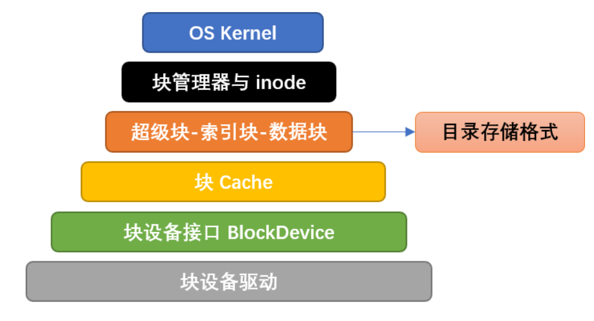

# 💾r-core实验6文件系统

## 操作系统的几个层次的说明


### 1. 块设备接口层
**就是和磁盘驱动通信的部分**
```rust
// easy-fs/src/block_dev.rs
pub trait BlockDevice : Send + Sync + Any {
    fn read_block(&self, block_id: usize, buf: &mut [u8]);//给磁盘号就能读一块
    fn write_block(&self, block_id: usize, buf: &[u8]);//给磁盘号就能写一块
}
```
- 他是把磁盘抽象成和内存一样的好几块了
  - 这个是文件系统做的,和操作系统没有关系,也就是所谓的`ext4`,

### 2. 块缓存层
> 存在的目的是为了加速IO操作

- 块缓存
```rust
// easy-fs/src/lib.rs

pub const BLOCK_SZ: usize = 512;

// easy-fs/src/block_cache.rs

pub struct BlockCache {
    cache: [u8; BLOCK_SZ],//初始化一个长度为512,元素是u8(正好一个字节)的数组,完全符合我们对一个块内存的定义
    //说明这个chache是开在内核堆空间的
    block_id: usize,//由于可能是任意一块,所以需要记录块编号,这里可以认为这个等价于磁盘上面的一块
    block_device: Arc<dyn BlockDevice>,//块属于哪个磁盘(磁盘可能有多个,比如一个电脑有两个m.2插槽)
    modified: bool,//脏位,快速判断写回是否需要修改,如果false他被写回的时候直接drop就好了
}// easy-fs/src/block_cache.rs

impl BlockCache {
    fn addr_of_offset(&self, offset: usize) -> usize {
        &self.cache[offset] as *const _ as usize
    }

    pub fn get_ref<T>(&self, offset: usize) -> &T where T: Sized {
        let type_size = core::mem::size_of::<T>();
        assert!(offset + type_size <= BLOCK_SZ);
        let addr = self.addr_of_offset(offset);
        unsafe { &*(addr as *const T) }
    }

    pub fn get_mut<T>(&mut self, offset: usize) -> &mut T where T: Sized {
        let type_size = core::mem::size_of::<T>();
        assert!(offset + type_size <= BLOCK_SZ);
        self.modified = true;
        let addr = self.addr_of_offset(offset);
        unsafe { &mut *(addr as *mut T) }
    }
}

```
- 这里复习以下rust的生命周期机制:
```rust
let a = cache.get_ref::<f32>(1);
let b = cache.get_ref::<f32>(5); // 这是允许的（都是共享引用）
//但是如果
let a = cache.get_ref::<f32>(1);
let m = cache.get_mut::<f32>(5); // ❌ 不行：已有共享借用时不能再独占借用
//这里的生命周期还需要保证a活得肯定要比cache短,因为这个地方不发生复制,是共享同一个内存进行引用的
```

- 这个数据结构是遵循`RAII`思想的,他的drop也就是判断是否写回的函数
```rust
// easy-fs/src/block_cache.rs

impl BlockCache {
    pub fn sync(&mut self) {
        if self.modified {
            self.modified = false;
            self.block_device.write_block(self.block_id, &self.cache);
        }
    }
}

impl Drop for BlockCache {
    fn drop(&mut self) {
        self.sync()
    }
}
```


## 数据结构的说明

### TaskControlBlockInner进化了
```rust
pub struct TaskControlBlockInner {
    pub trap_cx_ppn: PhysPageNum,
    pub base_size: usize,
    pub task_cx: TaskContext,
    pub task_status: TaskStatus,
    pub memory_set: MemorySet,
    pub parent: Option<Weak<TaskControlBlock>>,
    pub children: Vec<Arc<TaskControlBlock>>,
    pub exit_code: i32,
    pub fd_table: Vec<Option<Arc<dyn File + Send + Sync>>>,
}
```
- 发现其实只是多了一个fd_table,但是这个非常关键,因为同一个文件会被好多进程共享

```{note}
rust中的多态:类似cpp中的templete,是一个未知的数据类型,但是我们知道他一定有哪些方法
- 这里`dyn File + Send + Sync>`就是一个多态,他表示任何拥有`File`,`Send`,`Sync`方法的数据类型
```

```{note}
常见的文件描述符,就是我们的操作系统最开始的时候为初始进程初始化的那些
fd_table: vec![
    // 0 -> stdin 标准输入
    Some(Arc::new(Stdin)),
    // 1 -> stdout 标准输出
    Some(Arc::new(Stdout)),
    // 2 -> stderr 标准异常
    Some(Arc::new(Stdout)),
],
```

- 这里的File是操作系统中的文件
```rust
pub trait File: Send + Sync {
    /// the file readable?
    fn readable(&self) -> bool;
    /// the file writable?
    fn writable(&self) -> bool;
    /// read from the file to buf, return the number of bytes read
    fn read(&self, buf: UserBuffer) -> usize;
    /// write to the file from buf, return the number of bytes written
    fn write(&self, buf: UserBuffer) -> usize;
}
pub struct UserBuffer {
    /// A list of buffers,就是好多字节数据
    pub buffers: Vec<&'static mut [u8]>,
}
```


### BLOCK_DEVICE
> 可以理解为就是磁盘,提供磁盘第几块还有一个内存段,就可以进行读写操作

```rust
pub trait BlockDevice: Send + Sync + Any {
    ///Read data form block to buffer
    fn read_block(&self, block_id: usize, buf: &mut [u8]);
    ///Write data from buffer to block
    fn write_block(&self, block_id: usize, buf: &[u8]);
}

type BlockDeviceImpl = virtio_blk::VirtIOBlock;
lazy_static! {
    /// The global block device driver instance: BLOCK_DEVICE with BlockDevice trait
    pub static ref BLOCK_DEVICE: Arc<dyn BlockDevice> = Arc::new(BlockDeviceImpl::new());
}

```

```{note}
这里我们的BLOCK_DEVICE是对`virtio_blk::VirtIOBlock`的一个封装,他是一个虚拟的磁盘应用,
我们的封装其实没有提供查询总容量的接口,所以和真实的硬盘还是有差距的,总之在我们的实验里面理解那个接口就ok了
- **这里还要注意BLOCK_DEVICE是一个ARC对象,而且他支持多进程访问,就是(可以被不同进程同时引用,可以被移动到多个线程)**
```

### 从一个测试用例来看本章的文件系统
- 找不到文件是从网站上面拿的
```rust
// user/src/bin/filetest_simple.rs

#![no_std]
#![no_main]

#[macro_use]
extern crate user_lib;

use user_lib::{
    open,
    close,
    read,
    write,
    OpenFlags,
};

#[no_mangle]
pub fn main() -> i32 {
    let test_str = "Hello, world!";
    let filea = "filea\0";
    let fd = open(filea, OpenFlags::CREATE | OpenFlags::WRONLY);
    assert!(fd > 0);
    let fd = fd as usize;
    write(fd, test_str.as_bytes());
    close(fd);

    let fd = open(filea, OpenFlags::RDONLY);//返回的是有符号的,因为有可能打开失败
    assert!(fd > 0);
    let fd = fd as usize;
    let mut buffer = [0u8; 100];
    let read_len = read(fd, &mut buffer) as usize;
    close(fd);

    assert_eq!(
        test_str,
        core::str::from_utf8(&buffer[..read_len]).unwrap(),
    );
    println!("file_test passed!");
    0
}

```