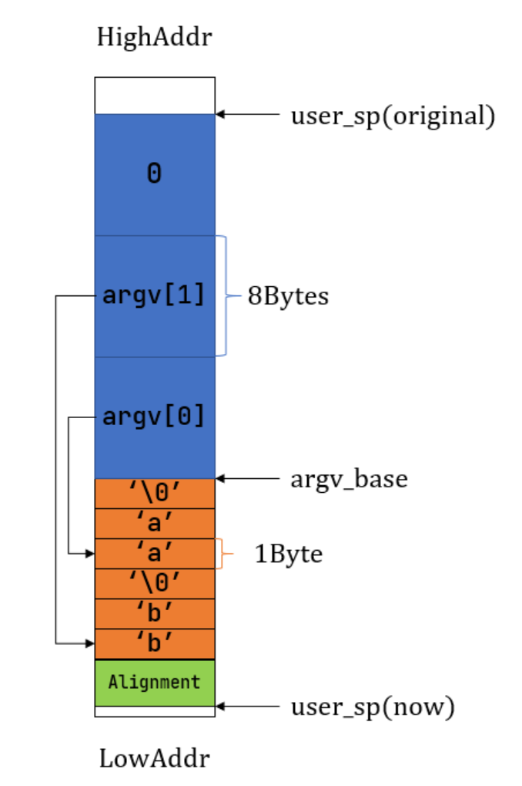

# 🐧r-core实验6文件系统

```{note}
不知道是哪个版本的rust颠了,反正现在需要把工具链换成是`channel = "nightly-2024-05-02"`之后的
```
## 管道

```{note}
管道本质就两个文件,一个只能读一个只能写,但是他们在操作系统里面是封装成两个结构体的
```
- 一个管道本身是一个实现了文件操作的结构
```rust
pub struct Pipe {
    readable: bool,
    writable: bool,
    buffer: Arc<UPSafeCell<PipeRingBuffer>>,
}
pub struct PipeRingBuffer {//一个有引用计数的循环队列
    arr: [u8; RING_BUFFER_SIZE],
    head: usize,
    tail: usize,
    status: RingBufferStatus,
    write_end: Option<Weak<Pipe>>,//保留的目的是让只有读权限的pipe也可以看到写端
}

```

### rust小课堂.弱引用`weak`还有强引用`Arc`

- 弱引用只是记录一个地址,不保证指针对应的对象的生命周期
  - 也就是说这个地方`PipeRingBuffer`不保证`Pipe`的生命周期,Pipe死了也不会有影响
  - 但是`Pipe`持有的指针`buffer`,他会保证`PipeRingBuffer`的生命周期,只要`Pipe`还活着,`PipeRingBuffer`就不能死
  - 如果相互使用`Arc`引用,释放的时候会有难题,逻辑上就谁也无法释放谁,形成引用环,有内存泄漏
  

## 关于系统调用的更改


- sys_exec
### 用户传入一个命令的字符串还有一个args的数据

```{note}
- 这里说明以下关于数组的底层
- 他是一个地址存放好多字符串的首地址,最后一个元素是0
```

**在生成的新应用中,需要在新的应用的栈里面放入argc 还有argv**



最后需要把`argc`和`argv`的数据信息放到`x10`还有`x11`里面

## 输入输出重定向

- `sys_dup`就是把文件输入符号拷贝,本意是为了下面的
```rust
pub fn sys_dup(fd: usize) -> isize {
	trace!("kernel:pid[{}] sys_dup", current_task().unwrap().pid.0);
    let task = current_task().unwrap();
    let mut inner = task.inner_exclusive_access();
    if fd >= inner.fd_table.len() {
        return -1;
    }
    if inner.fd_table[fd].is_none() {
        return -1;
    }
    let new_fd = inner.alloc_fd();
    inner.fd_table[new_fd] = Some(Arc::clone(inner.fd_table[fd].as_ref().unwrap()));
    new_fd as isize
}

```

- 重定向就是把0 或者1的输入输出换成是输入的一个文件