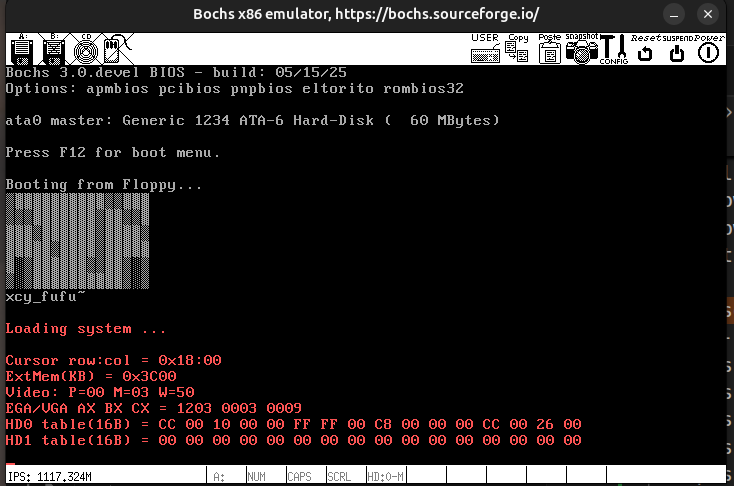

# 实验3

## 需要看的文件
```{note}
- `bootsect.s`:
- `setup.s`:

提示没法挂载root就去老师哪里偷一个硬盘文件(`hdc-0.11.img`)过来

?自己创建,那太麻烦了:)
```

## 启动流程

- 老规矩`b 0x7c00`停在开始位置,然后他似乎是把代码搬家了,所以之后是停在`0x9001d`
- 然后是根据扇区去读,最后把操作系统搬迁到`0x1000`
- 然后断点打在`0x90200`就可以到setup了
    - setup就是切换到保护模式,然后开始运行终端程序


## 总结下如果打印字符(int 0x10)

```text
	mov	$0x03, %ah		# read cursor pos
	xor	%bh, %bh
	int	$0x10
	
	mov	$24, %cx
	mov	$0x0007, %bx		# page 0, attribute 7 (normal)
	#lea	msg1, %bp
	mov     $msg1, %bp
	mov	$0x1301, %ax		# write string, move cursor
	int	$0x10
```
**两次中断分别是**

- 1. 读取光标位置(也是使用int 0x10 0x03的功能)
  - 说明:这个中断的返回值写在`DH` `DL`里面,光标形状在`CH/CL`
  - 调用参数在`AH`功能序号,0x03表示读光标位置,`BH`是视频页号
- 2. 写字符串(使用int 0x10 0x13的功能)
  - 输入参数:
    - `AH`:功能号*0x13*是写,
    - `BX`是BH和BL(high和low)BH=0是只页号是0 BL=0x07是文本属性
    - `CX`是字符数 24表示24个字符
    - `BP` 字符串的地址

```{note}
读光标的意义是什么?(第一次中断的意义?)
- 是为了在合适的位置放入字符,似乎设置的是cx
- 能不能优化成使用一次中断呢?
```


## 最后打印出来的硬件信息



- 1. curser是光标信息
- 2. 内存信息`ExtMem(KB) = 0x3C00` 0x3c00是15K,所以估计是15MB,这个之前还有`0x100000`
  - 所以一共是16MB

## 代码附件

### `bootsect.s`

<a href="../../_static/files/操作系统/bootsect.s" download>bootsect.s_点我下载哦</a>


### `setup.s`

<a href="../../_static/files/操作系统/setup.s" download>setup.s_点我下载哦</a>

