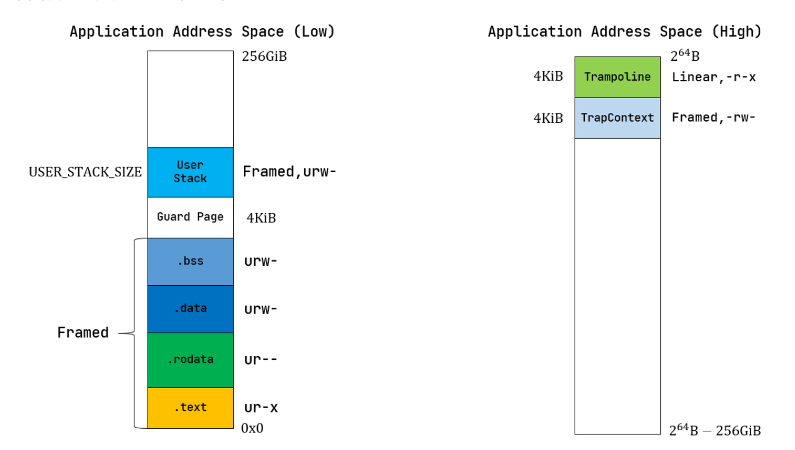

# 🪟功能说明
```{note}
说明下这个操作系统实现的功能,实现的方法
- 1. 把他当作可执行程序,从main函数开始看
- 2. 
```

## 从一个标准程序看本操作系统

### 1. 初始化虚拟内存
TODO
### 2. 初始化trap 
TODO
### 3. 初始化时钟
TODO
### 4. 初始化文件系统
TODO
### 5. 初始化第一个应用程序
```{note}
他放在第二块磁盘里面,利用了rust的`lazy_static`机制,调用add_initproc加载,但是他入ready队列的时机是`ProcessControlBlock::new(v.as_slice())`
- 这个new方法在最后把他放入队列
```

### 6. 应用程序内存布局

- 把应用加载完毕之后放到`ready_queue`,之后使用调度算法就可以正常跳转到第一个任务执行

## 从进程/线程的角度去看操作系统

### 总叙述
```{note}
进程/线程会发生的事情
- 1. 进程切换
  - 无论是时钟的打断还是进程sleep主动的打断,都会有类似的切换发生
- 2. 调度
  - 进程在切换的时候需要选择合适的调度算法执行对应的进程
- 3. 进程/线程状态的维护
```

### 1. TaskContext

```rust
///保存的是一个进程的基本信息,相当于是一个简答的tss
pub struct TaskContext {
    /// Ret position after task switching
    ra: usize,
    /// Stack pointer
    sp: usize,
    /// s0-11 register, callee saved,
    s: [usize; 12],
}
```