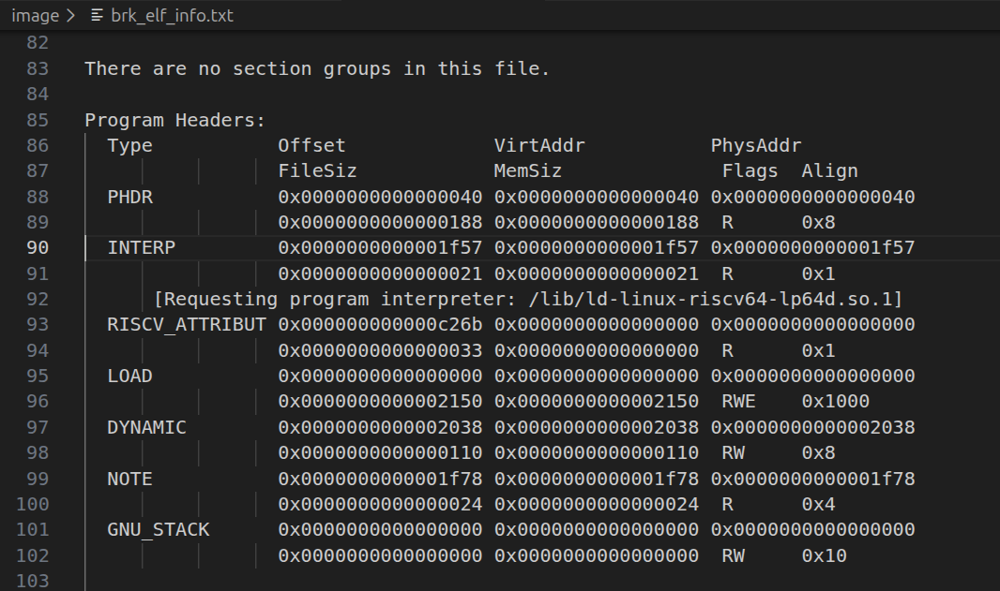

# 记录开发中遇到的奇闻异事

## 1. 发现解释器执行终端命令的时候输出是交叉的

- 初步审查,每一次都是等待一个任务退出,没有问题
- 后来发现是for循环把分割没有使用换行,把所有的程序当成一个参数了...


- 最后的修改是给for循环加上一个分割

```rust
for value in parts {
//这里是访问剩下的所有参数的意思
    let expanded = expand_string(value, ctx, false);
    if expanded.is_empty() {
        continue;
    }
    if expanded.chars().any(|c| c.is_ascii_whitespace()) {
        // Mirror shell word splitting so "$tests" with newlines/spaces becomes multiple items.
        for part in expanded.split_whitespace() {
            if !part.is_empty() {
                values.push(String::from(part));
            }
        }
    } else {
        values.push(expanded);
    }
}
```

- 对比之前的
```rust
for value in parts {
    values.push(expand_string(value, ctx, false));
}
```

## 2. 测例里面的elf程序会有动态连接
```{note}
根据elf的约定动态连接的lib会放在`PT_DYNAMIC`段,这个段一般指向一个.so文件


```
- 具体的加载过程是解释对应的段

## 3. 开始实现busybox

###  1' ext4文件系统的缓存机制

- 执行`find -name \"busybox_cmd.txt\"`,发现奇慢无比,最后决定给ext4文件系统加上一个缓存(gpt的建议)
- `third_party/ext4_rs/src/ext4_defs/block.rs`里面实现了一个缓存,之后访问磁盘的时候

### 2' `/proc/mounts`

- 执行`df`的时候他的动作是读取`/proc/mounts`,查询资料得知这个是一个伪文件系统,ubuntu上的这个文件有140TB,所以他不可能存在于真正的磁盘上