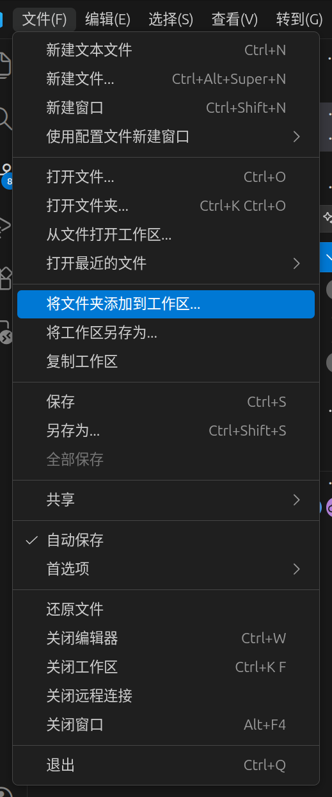
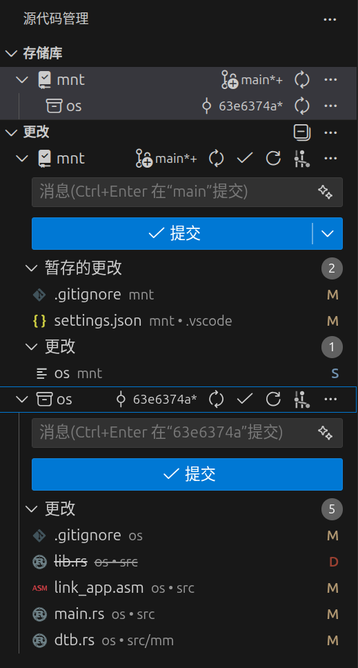

# 看聪哥的代码

```{important}
1. 现在不知道rust默认的mutex在我们的操作系统里面是什么行为

```

```{note}
在一个仓库里面建立子仓库
- 子仓库的.git不会保存在他自己那里,而是在仓库根目录.git文件夹的modules文件夹里面
- 如果想要在vscode里面使得左边那个源代码管理添加仓库,那么需要先在左上角的文件里面添加工作区
- 子模块的更改是作为一个文件影响根模块的




- 简单的操作在下面
```

```bash
git config --global --add safe.directory /mnt/os #在根目录执行可以避免安全检查,这样就可以访问子目录了
git submodule update --init --recursive #初始化所有的子文件夹


```


## 操作系统基础知识

### 关于启动程序的时候内核做的

- linux在启动一个应用的时候会传入下面四个参数

```rust
tcx.x[REG_A0] = args.len();
tcx.x[REG_A1] = argv_base;
tcx.x[REG_A2] = envp_base;
tcx.x[REG_A3] = auxv_base;
```

- envp是一些环境变量的参数,比如opencv有的时候会使用那些去判断使用什么窗口
- auxv是一些内核提供的信息


## rust的包管理机制

- crate是当前编译文件的根模块目录

## fdt树

- 保存的信息就是硬件设备给操作系统留下的描述信息
- 他被组织成一个树结构,可以看一下qemu模拟器提供的fdt

```bash
qemu-system-riscv64 -machine virt,dumpdtb=/tmp/virt.dtb -nographic -S
dtc /tmp/virt.dtb #使用dtc解码这个
```
<a href="../../_static/files/操作系统/dtb_decoded.txt" download>下载解析出来的dtc</a>

- 下面是一个简单的例子
```txt

/dts-v1/;      #使用的是v1标准

/ {            #表示设备树的根节点,一般就是指设备树地址,没啥意义
	#address-cells = <0x02>;#一个地址两个cell.
	#size-cells = <0x02>;#一个地址上面的内容大小是两个cell 
                         #所以制定寄存器的时候需要四个cell,比如<0x00 0x00 0x4000000 0x2000000>;前两位是地址,后两位是大小(单位是字节)
	compatible = "riscv-virtio";#一个平台的信息
	model = "riscv-virtio,qemu";#平台的模型,用来匹配驱动标准的

	poweroff {
		value = <0x5555>;
		offset = <0x00>;
		regmap = <0x04>;
		compatible = "syscon-poweroff"; #表示这个对象需要使用system controller寄存器来控制
        #ps:system controller是一个寄存器区域块,他对应的把一些重要的寄存器映射成为了一块内存区域
        #在哪里写触发硬件关机?根据regmap = <0x04>;,找到phandle为<0x04>的块,在下面,读取他的内容,
        #他是从0x100000开始的然后这个poweroff对应的offset是0x00,需要写的值是0x5555,
        #所以在0x100000 + 0x00地方写0x5555就会关机
	};

	reboot {
		value = <0x7777>;
		offset = <0x00>;
		regmap = <0x04>;
		compatible = "syscon-reboot";
	};

    test@100000 {
        phandle = <0x04>;
        reg = <0x00 0x100000 0x00 0x1000>; #这个表示首地址是0x100000,大小是0x1000,表示有这么多个字节可以写
        compatible = "sifive,test1\0sifive,test0\0syscon";
    };
}
```

## mmio

- 本质是cpu使用正常访问内存的指令去控制一些外设的寄存器

```rust
pub const MMIO: &[(usize, usize)] = &[
    (0x0010_0000, 0x00_2000), // VIRT_TEST/RTC  in virt machine,这是两个部分前0x1000是VIRT_TEST,后0x1000是RTC
    (0x1000_1000, 0x00_1000), // Virtio Block in virt machine
    (0x1000_2000, 0x00_1000), // Virtio Block (bus 1) in virt machine
];
```

- 对应的fdt表中的项
```txt
test@100000 { #在soc下面
    phandle = <0x04>;
    reg = <0x00 0x100000 0x00 0x1000>;
    compatible = "sifive,test1\0sifive,test0\0syscon";
};
rtc@101000 { #在soc下面
    interrupts = <0x0b>;
    interrupt-parent = <0x03>;
    reg = <0x00 0x101000 0x00 0x1000>;
    compatible = "google,goldfish-rtc";
};

virtio_mmio@10001000 { #也是在soc下面
    interrupts = <0x01>;
    interrupt-parent = <0x03>;
    reg = <0x00 0x10001000 0x00 0x1000>;
    compatible = "virtio,mmio";
};
```


## 关于虚拟内存空间

### 内核处
- 常规的map了各个程序段,之后还map了kernel之后的整个内存空间,这个地方页表还是使用

## SIE寄存器

```{note}
是riscv的和中断相关的控制寄存器主要有:
- `SSIE`：软件中断使能（IPI 常用）
- `STIE`：定时器中断使能（时钟 tick 常用）
- `SEIE`：外部中断使能（外设中断）
```

- 例如启动时钟寄存器的时候是使用

```rust
sie::set_stimer();
```

## 关于文件系统

```{note}
文件系统需要一个底层的驱动实现读某一个字节和写某一个字节,底层驱动使用的是mmio映射,把硬盘设备的读写寄存器暴露到内存中
- mmio映射可以理解为硬件把他的寄存器暴露出来,使得cpu可以使用访问内存的指令去访问对应的硬件寄存器
```

### 简单的关于文件系统的知识

- inode:
  - 文件对应的编号(目录也是文件)
  - inode本身也保存有很多数据,比如文件大小,修改时间,修改权限,文件数据块位置等等
- bitmap
  - 记录哪些块是空闲的,分为block bitmap和inode bitmap
- inode table
  - 把inode编号映射成inode块的数据结构
- 可以把磁盘看成是提供块和偏移就可以读取字节数据的硬件结构
  - 解析inode的目的也是这个

### 对于底层设备的要求

- 底层设备mmio里面对应的type是block
- 实现Transport和Hal接口

### 关于/proc

- 本质是linux的一个虚拟文件系统,目的是暴露内核的一些数据结构,使得用户可以访问
  - 例如cpu信息,内存信息,进程使用的命令和状态等

- 聪哥的proc为什么是磁盘上的文件???

## 关于调度算法

- 似乎聪哥的调度做得挺完善的,他目前有三种算法

```rust
/// 调度类别。
///
/// - `Fair`：普通公平调度类，对应 `SCHED_OTHER` / `SCHED_BATCH` / `SCHED_IDLE` 这类非实时策略。
///   这类任务通常放入公平队列，按类似 vruntime 的方式选择下一个运行者。
/// - `Fifo`：实时先进先出调度，对应 `SCHED_FIFO`。同优先级任务一般按进入队列的先后顺序运行，
///   只会在主动让出 CPU、阻塞，或被更高优先级实时任务抢占时切换。
/// - `Rr`：实时轮转调度，对应 `SCHED_RR`。在实时优先级语义上接近 `Fifo`，但同优先级任务会按时间片轮转。
#[derive(Copy, Clone, Debug, PartialEq, Eq)]
pub enum SchedClass {
    Fair,
    Fifo,
    Rr,
}
```

```{note}
task是最小的运行单位,他的主要召唤者是process,一个process下可以有多个task
```

```rust
//调度算法保存task的结构
//这个结构每个cpu都有一个
struct HartRunQueue {
    //实时队列
    rt_queues: alloc::vec::Vec<VecDeque<Arc<TaskControlBlock>>>,
    //公平队列
    fair_groups: BTreeMap<u64, FairGroupQueue>,
}

```


- 区分使用Rt还是fair调度使用的是process的设置,这个设置应该是可以用系统调用调整的
### ReadyQueueSlot::Rt

- 这个会把task放在一个队列rt_queues里面
- 每个prcess会保存一个优先级别rt_priority
  - RT_PRIO_MAX - normalized_rt_priority(priority)
  - 这里的normalized_rt_priority把他映射到区间,区间外的直接映射为端点

- 队列的优先级直接体现在fetch的时候是优点遍历上层队列的
```rust
let rq = &mut self.ready_queues[hart_id];//取出对应核心的调度管理结构体
let mut picked = None;
for rtq in rq.rt_queues.iter_mut() {
    if let Some(task) = Self::pop_ready_candidate(rtq, hart_id) {
        picked = Some(task);
        break;
    }
}
```


```{important}
- 选择这个调度的task只要他的process优先级高,他就会一直抢占cpu,可能会导致饥饿,似乎我们的代码没有自动改变优先级的机制
```

### ReadyQueueSlot::Fair

```{note}
背景知识:
- linux在CGROUP里面维护了每一个线程对应的组编号还有他的share
- 似乎这些都是可以通过系统调用改的,修改之后能影响进程调度

```


## 系统调用的分析

### mount

- mount表的底层目前只是一个简单的vec

```rust
static ref MOUNT_TABLE: Mutex<Vec<MountRecord>> = Mutex::new(Vec::new());
```

## 需要实现的伪文件

### /proc

## 关于启动流程

- 直接使用脚本就可以启动
```bash
ARCH=riscv64 bash os/run.sh
```

- 脚本里面寻找可执行文件的流程,比如执行ps
  - 1. 遍历`path`里面的路径,挨个拼接
  - 比如`path`是`/bin`,那么先执行`/bin/ps`

### 关于gdb的使用

```bash
# /usr/bin/gdb-multiarch
file /mnt/os/target/riscv64gc-unknown-none-elf/release/os
set arch riscv:rv64
target remote localhost:1234

b os::syscall::filesystem::syscall_mkdirat
c
```

### 1. 先是制作系统盘

- 打包在`ext4-fs-packer/target/fs.ext4`里面
- 保证拥有`/tmp` ,`/bin`,`/usr/bin`等目录存在

```bash
debugfs -R "ls -p /" ext4-fs-packer/target/fs.ext4
debugfs -R "ls -p /user" ext4-fs-packer/target/fs.ext4
debugfs -R "ls -p /extra" ext4-fs-packer/target/fs.ext4

```
