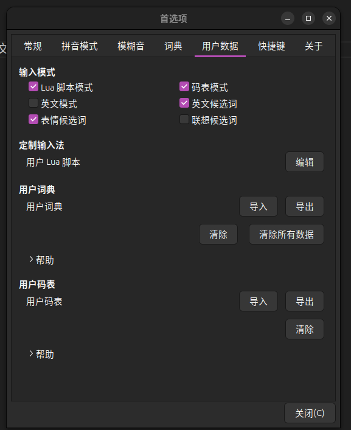

# 🏰妙妙道具仓库

## ubuntu输入法没有办法打出u和v

- 解决办法
打开输入法首选项,在用户数据中去掉英文模式
<!--  -->

## 人生大作matplotlib-cpp
> fork自 [我是链接](https://github.com/lava/matplotlib-cpp.git)

<a href="../_static/files/matplotlibcpp.h" download>我更喜欢html语法</a>

<!-- 想要使用这个记得在conf.py里面 html_static_path = ["_static"]-->
<!-- <a href="{{ '_static/files/matplotlibcpp.h' | relative_url }}" download>下载 文件</a>这个是Jinjia2写法 -->
{download}`这个是sphinx的写法 <../_static/files/matplotlibcpp.h>`

