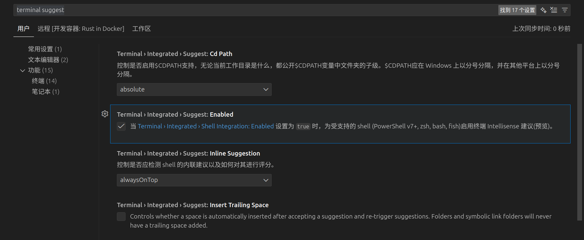
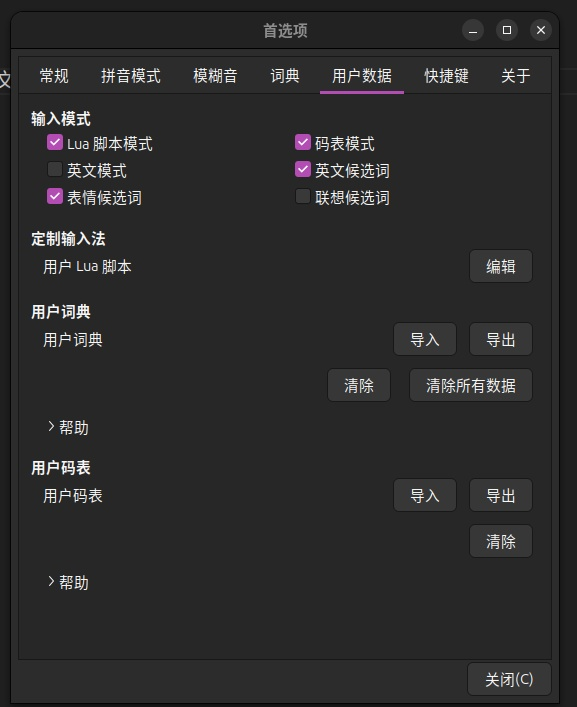
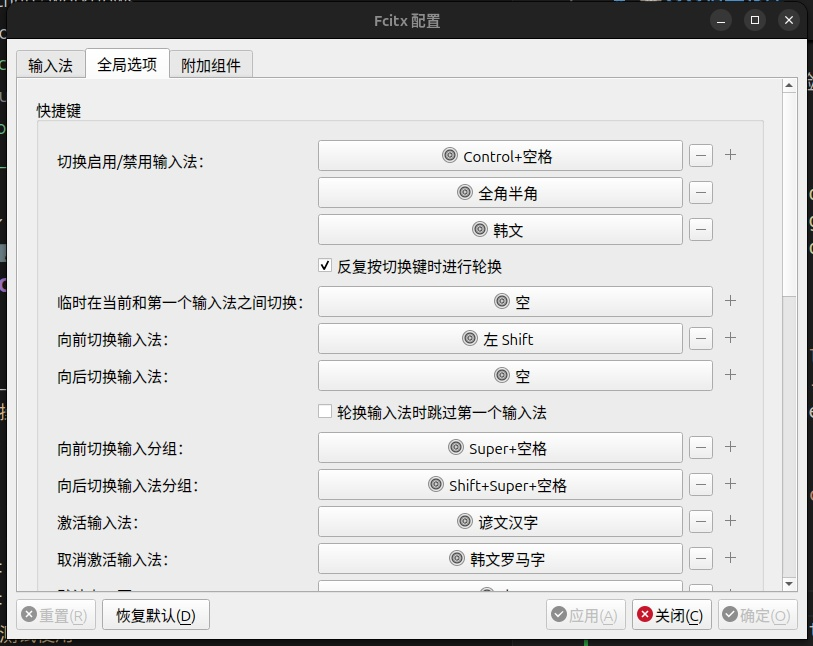

# 🏰妙妙道具仓库

- 写文档的时候使用html标签插入 `src="../_static/img/测试使用/ubuntu输入法.jpg图片"` 
- 16转10进制log计数法,0x20000 两位一组,一组是$2^8$ 所以这里就是 $1+8+8$ 是$2^{17}$,然后$2^{10}$为1KB,所以是$2^7$为128KB
- 
<a href="#传送">神奇传送门</a>
<a id="传送"></a>

## 一些话
- 关闭逆天vscode的终端提示
```{note}
在设置搜索`terminal suggest`,把大概是第二个那个设置为false



```


## ubuntu合集

### 在ubuntu里面使用文件链接实现空间节约
- 注意`ln`要使用`-s`,不然是使用默认的硬链接,还有传入的两个参数要使用绝对路径,不然创建了也识别不了
```bash
ln -s "$(pwd)/data" /home/hitcrt/paper_reading/take_talking2dino/data
```

### 使用nautilus配置脚本实现右键打开vscode

- 使用的文件夹`/home/hitcrt/.local/share/nautilus/scripts`
```bash
#!/bin/bash
#/home/hitcrt/.local/share/nautilus/scripts
# 打开选中的文件/目录
for item in "$@"; do
  # 使用 VS Code 打开
  code "$item"
done

```

### gpw鼠标滚轮回滚
> 好像是xorg的问题,我目前换成wayland了,似乎错怪logitech了,偶不

### systemctl介绍

```{note}

`systemctl` 是 Linux 系统中用于管理系统和服务的工具，特别是在使用 `systemd` 初始化系统的操作系统中，像 Ubuntu 24。

```

- 1. 查看服务状态

```bash
systemctl status nginx
```

- 2. 启动和停止服务


```bash
sudo systemctl start nginx
sudo systemctl stop nginx
sudo systemctl restart nginx

sudo systemctl enable nginx #使服务开机启动
sudo systemctl disable nginx # 关闭开机启动

systemctl list-units --type=service # 显示所有服务的状态
systemctl reload nginx


```

### 查看系统上可用的端口

```bash
ss -tuln

```

- 说明:
  - `t`：显示 TCP 连接。

  - `u`：显示 UDP 连接。

  - `l`：显示监听（listening）状态的端口。

  - `n`：显示数字形式的地址和端口号，而不是尝试解析为域名和服务名称。

### ubuntu输入法没有办法打出u和v

- 解决办法
打开输入法首选项,在用户数据中去掉英文模式
<!--  -->



> ibus还是太牢了,这个真心是有点不好用了,快来加入fcitx5~ <a href="#传送fcitx5">安装fcitx5</a>


### 想要在ubuntu杀死一个进程

```bash 
ps-ef | grep 执行使用的命令
kill -9 进程号 #找到进程pid之后
```

### 使用rar命令

```{note}
ubuntu24不自带文件压缩器(file-roller)?
我怀疑是有来自微软的某国工程师贡献巧计了,这股妖风还是从apple吹过来了
`sudo apt install file-roller`拯救一切
```

```bash
sudo apt-get install rar unrar
rar a -r  043-谢辰阳-read03.rar 043-谢辰阳-read03/
unrar x 043-谢辰阳-read03.rar
```
<a id="传送fcitx5"></a>

### 加入fcitx5~

> 根据xcy的使用体验ibus并不好用,我选择加入fcitx5

```bash
sudo apt install fcitx5 \
fcitx5-chinese-addons \
fcitx5-frontend-gtk4 fcitx5-frontend-gtk3 fcitx5-frontend-gtk2 \
fcitx5-frontend-qt5
```
- 然后配置主题可以在这里找到[fcitx主题](https://github.com/topics/fcitx5-theme)
```bash
mkdir -p ~/.local/share/fcitx5/themes
cd fcitx5-themes-candlelight
cp -r <theme-name> ~/.local/share/fcitx5/themes/

# 配置主题的
nano ~/.config/fcitx5/conf/classicui.conf
```

- 添加下面的
```txt
Vertical Candidate List=False
PerScreenDPI=True
Font="Smartisan Compact CNS 13"
Theme=<theme-name>
```
<a href="../_static/files/macOS-dark.zip" download>fcitx5主题下载连接</a>

- 把向前切换改成shift就可以使用shift切换中英文输入了



> 不要忘记在分组里面加上中文和英文

- 如果想要下载词库[一般是这个链接](https://github.com/felixonmars/fcitx5-pinyin-zhwiki/releases)

```bash
# 下载词库文件
wget https://github.com/felixonmars/fcitx5-pinyin-zhwiki/releases/download/0.2.4/zhwiki-20220416.dict
# 创建存储目录
mkdir -p ~/.local/share/fcitx5/pinyin/dictionaries/
# 移动词库文件至该目录
mv zhwiki-20220416.dict ~/.local/share/fcitx5/pinyin/dictionaries/
```

> 不要删除ibus!!!,不然我们打开设置啥的都会很慢~没事留着当作无能的丈夫就好:)

### 关于`vscode`的`markdown`编辑插件:
- `ExecutableBookProject.myst-highlight`:MyST-Markdown
- `yzhang.markdown-all-in-one`:Markdown All in One
- 两个一起开,这样`{note}`标签,还有markdown all in one的快捷键都能使用


## 人生大作matplotlib-cpp
> fork自 [我是链接](https://github.com/lava/matplotlib-cpp.git)

<a href="../_static/files/matplotlibcpp.h" download>我更喜欢html语法</a>

<!-- 想要使用这个记得在conf.py里面 html_static_path = ["_static"]-->
<!-- <a href="{{ '_static/files/matplotlibcpp.h' | relative_url }}" download>下载 文件</a>这个是Jinjia2写法 -->
{download}`这个是sphinx的写法 <../_static/files/matplotlibcpp.h>`


## 看懂论文需要了解他的创新点
> 使用的体诗词
>```txt
>你可以帮我阅读这个文章然后告诉我他的基本内容，然后他是使用什么办法解决的clip文本还有视觉特征对不齐的问题，
>最好加上他的实验数据，对于他提出的方法进行作证(然后附上论文的pdf)
> ```

## 在conda里面使用ros

### 在conda里面安装colcon
> 我们可以在虚拟环境里面调用不是虚拟环境的python的包,但是python版本要一致

```bash
# 先确认自己的系统python版本
conda create -n your_environment_name python=3.12.3
conda activate your_environment_name
pip install rospkg
pip install -U colcon-common-extensions

python -m colcon build #使用这个命令指定虚拟环境里面的python
```